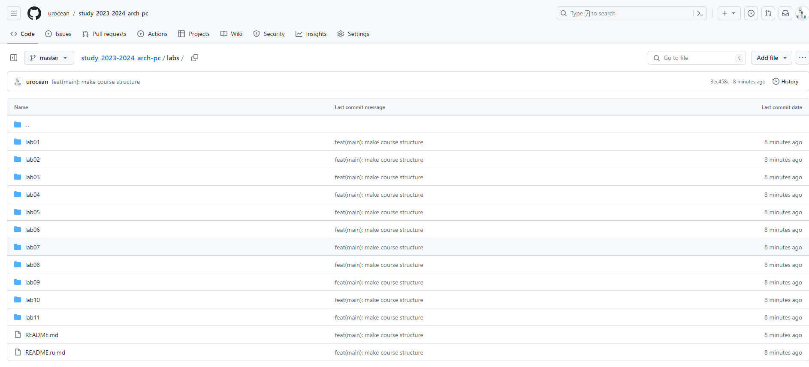

---
## Front matter
title: "Отчёт по лабораторной работе №2"
subtitle: "Дисциплина: Архитектура компьютера"
author: "Осина Виктория Александровна"

## Generic otions
lang: ru-RU
toc-title: "Содержание"

## Bibliography
bibliography: bib/cite.bib
csl: pandoc/csl/gost-r-7-0-5-2008-numeric.csl

## Pdf output format
toc: true # Table of contents
toc-depth: 2
lof: true # List of figures
lot: true # List of tables
fontsize: 12pt
linestretch: 1.5
papersize: a4
documentclass: scrreprt
## I18n polyglossia
polyglossia-lang:
  name: russian
  options:
	- spelling=modern
	- babelshorthands=true
polyglossia-otherlangs:
  name: english
## I18n babel
babel-lang: russian
babel-otherlangs: english
## Fonts
mainfont: PT Serif
romanfont: PT Serif
sansfont: PT Sans
monofont: PT Mono
mainfontoptions: Ligatures=TeX
romanfontoptions: Ligatures=TeX
sansfontoptions: Ligatures=TeX,Scale=MatchLowercase
monofontoptions: Scale=MatchLowercase,Scale=0.9
## Biblatex
biblatex: true
biblio-style: "gost-numeric"
biblatexoptions:
  - parentracker=true
  - backend=biber
  - hyperref=auto
  - language=auto
  - autolang=other*
  - citestyle=gost-numeric
## Pandoc-crossref LaTeX customization
figureTitle: "Рис."
tableTitle: "Таблица"
listingTitle: "Листинг"
lofTitle: "Список иллюстраций"
lotTitle: "Список таблиц"
lolTitle: "Листинги"
## Misc options
indent: true
header-includes:
  - \usepackage{indentfirst}
  - \usepackage{float} # keep figures where there are in the text
  - \floatplacement{figure}{H} # keep figures where there are in the text
---

# 1. Цель работы

Целью работы является приобретение практических
навыков по работе с git и изучение идеологии и применения
средств контроля версий.

# 2. Задание

1. Настройка github.
2. Базовая настройка git.
3. Создание SSH ключа.
4. Создание рабочего пространства и репозитория курса на основе шаблона.
5. Создание репозитория курса на основе шаблона.
6. Настройка каталога курса.
7. Задание для самостоятельной работы.

# 3. Теоретическое введение

	Системы контроля версий (Version Control System, VCS) применяются при работе нескольких человек над одним проектом. Обычно основное дерево проекта хранится в локальном или удалённом репозитории, к которому настроен доступ для участников проекта. При внесении изменений в содержание проекта система контроля версий позволяет их фиксировать, совмещать изменения, произведённые разными участниками проекта, производить откат к любой более ранней версии проекта, если это требуется. 
	В классических системах контроля версий используется централизованная модель, предполагающая наличие единого репозитория для хранения файлов. Выполнение большинства функций по управлению версиями осуществляется специальным сервером. Участник проекта (пользователь) перед началом работы посредством определённых команд получает нужную ему версию файлов. После внесения изменений, пользователь размещает новую версию в хранилище. При этом предыдущие версии не удаляются из центрального хранилища и к ним можно вернуться в любой момент. Сервер может сохранять не полную версию изменённых файлов, а производить так называемую дельта-компрессию — сохранять только изменения между последовательными версиями, что позволяет уменьшить объём хранимых данных. 
	Системы контроля версий поддерживают возможность отслеживания и разрешения конфликтов, которые могут возникнуть при работе нескольких человек над одним файлом. Можно объединить (слить) изменения, сделанные разными участниками (автоматически или вручную), вручную выбрать нужную версию, отменить изменения вовсе или заблокировать файлы для изменения. В зависимости от настроек блокировка не позволяет другим пользователям получить рабочую копию или препятствует изменению рабочей копии файла средствами файловой системы ОС, обеспечивая таким образом, привилегированный доступ только одному пользователю, работающему с файлом.
	Системы контроля версий также могут обеспечивать дополнительные, более гибкие функциональные возможности. Например, они могут поддерживать работу с несколькими версиями одного файла, сохраняя общую историю изменений до точки ветвления версий и собственные истории изменений каждой ветви. Кроме того, обычно доступна информация о том, кто из участников, когда и какие изменения вносил. Обычно такого рода информация хранится в журнале изменений, доступ к которому можно ограничить. В отличие от классических, в распределённых системах контроля версий центральный репозиторий не является обязательным. Среди классических VCS наиболее известны CVS, Subversion, а среди распределённых — Git, Bazaar, Mercurial. Принципы их работы схожи, отличаются они в основном синтаксисом используемых в работе команд.
	Система контроля версий git представляет собой набор программ командной строки. Доступ к ним можно получить из терминала посредством ввода команды git с различными опциями. Благодаря тому, что Git является распределённой системой контроля версий, резервную копию локального хранилища можно сделать простым копированием или архивацией.

# 4. Выполнение лабораторной работы.
## 4.1. Настройка github.

У меня уже создана учетная запись в github и заполнены основные данные. (рис. @fig:001)

{#fig:001 width=70%}

## 4.2. Базовая настройка git.

Чтобы сделать предварительную конфигурацию git, открываю терминал и ввожу необходимые команды, указав свои имя и email. (рис. @fig:002)

{#fig:002 width=70%}

Настраиваю utf-8 в выводе сообщений git. (рис. @fig:003)

{#fig:003 width=70%}

Задаю имя начальной ветки (будем называть её master). (рис. @fig:004)

{#fig:004 width=70%}

Задаю параметр autocrlf. (рис. @fig:005)

{#fig:005 width=70%}

Задаю параметр safecrlf. (рис. @fig:006)

{#fig:006 width=70%}

## 4.3. Создание SSH ключа.

Для последующей идентификации пользователя на сервере репозиториев необходимо сгенерировать пару ключей (приватный и открытый), поэтому я прописываю команду ssh-keygen -C "Имя Фамилия <work@mail>", указав своё имя и фамилию, а также свою почту. (рис. @fig:007)

{#fig:007 width=70%}

Эти ключи автоматически сохранятся в каталоге ~/.ssh/.

Далее необходимо загрузить сгенерированный открытый ключ, поэтому я захожу на сайт http://github.org/ под своей учётной записью и перехожу в меню Settings. (рис. @fig:008)

{#fig:008 width=70%}

После этого выбираю в боковом меню SSH and GPG keys (рис. @fig:009)

{#fig:009 width=70%}

и нажимаю кнопку New SSH key. (рис. @fig:010)

{#fig:010 width=70%}

Далее копирую из локальной консоли ключ в буфер обмена при помощи команды cat ~/.ssh/id_rsa.pub | xclip -sel clip. (рис. @fig:011)

{#fig:011 width=70%}

Теперь вставляю этот ключ в появившееся на сайте поле и указываю для ключа имя (Title). (рис. @fig:0012) и (рис. @fig:013)

{#fig:012 width=70%}

{#fig:013 width=70%}

## 4.4. Создание рабочего пространства и репозитория курса на основе шаблона.

При выполнении лабораторных работ следует придерживаться структуры рабочего пространства, которая должна располагаться в следующей иерархии:
~work/study/
	└── 2023–2024/
		└──Архитектура компьютера/
			└── arch-pc/
				└── labs/
					└── lab01
					└── lab02
					└── lab03
					....
Поэтому при помощи команды mkdir с ключом -p создаю каталог для предмета «Архитектура компьютера». (рис. @fig:014)

{#fig:014 width=70%}

## 4.5. Создание репозитория курса на основе шаблона

Перехожу на страницу репозитория с шаблоном https://github.com/yamadharma/course-directory-student-template и выбираю “Use this template”. (рис. @fig:015) и (рис. @fig:016)

{#fig:015 width=70%}

{#fig:016 width=70%}

В открывшемся окне задаю имя репозитория study_2023–2024_arch-pc и создаю репозиторий (кнопка Create repository). (рис. @fig:017)

{#fig:017 width=70%}

Репозиторий создан. (рис. @fig:018)

{#fig:018 width=70%}

На странице созданного репозитория копирую ссылку для клонирования (Code --> SSH --> Copy). (рис. @fig:019)

{#fig:019 width=70%}

Затем в терминале перехожу в каталог курса (рис. @fig:020)

{#fig:020 width=70%}

и клонирую созданный репозиторий. (рис. @fig:021)

{#fig:021 width=70%}

## 4.6. Настройка каталога курса

Перехожу в каталог курса. (рис. @fig:022)

{#fig:022 width=70%}

Удаляю лишний каталог. (рис. @fig:023)

{#fig:023 width=70%}

Создаю необходимые каталоги. (рис. @fig:024)

{#fig:024 width=70%}

Отправляю файлы на сервер. (рис. @fig:025) и (рис. @fig:026)

{#fig:025 width=70%}

{#fig:026 width=70%}

Проверяю правильность создания иерархии рабочего пространства. (рис. @fig:027) и (рис. @fig:028)

{#fig:027 width=70%}

{#fig:028 width=70%}

# 5. Задание для самостоятельной работы
##5.1. 
Создаю отчет по выполнению лабораторной работы в соответствующем каталоге рабочего пространства (labs>lab02>report). (рис. @fig:029)
{#fig:029 width=70%}

Отчет я выполняю в текстовом редакторе Word и т. к. на текущий момент я всё ещё взаимодействую с отчетом по данной (второй) лабораторной работе, то на github файл с отчетом я загружу позднее по тому же алгоритму, по которому сейчас буду добавлять отчет о первой лабораторной работе

##5.2.
Проверяю местонахождение файла с отчетом о первой лабораторной работе и копирую его в соответствующий каталог (labs>lab01>report). (рис. @fig:030) и (рис. @fig:031)

{#fig:030 width=70%}

{#fig:031 width=70%}

##5.3. 
Загружаю файл на github (рис. @fig:001)

{#fig:032 width=70%}

Проверяю github и убеждаюсь в том, что файл с отчетом загружен: (рис. @fig:033)

{#fig:0033 width=70%}

# Выводы

Я изучила идеологию и применение средств контроля версий, а также приобрела практические навыки по работе с системой git.

# Список литературы

1. ТУИС – Архитектура ЭВМ ](https://esystem.rudn.ru/pluginfile.php/2089082/mod_resource/content/0/%D0%9B%D0%B0%D0%B1%D0%BE%D1%80%D0%B0%D1%82%D0%BE%D1%80%D0%BD%D0%B0%D1%8F%20%D1%80%D0%B0%D0%B1%D0%BE%D1%82%D0%B0%20%E2%84%962.%20%D0%A1%D0%B8%D1%81%D1%82%D0%B5%D0%BC%D0%B0%20%D0%BA%D0%BE%D0%BD%D1%82%D1%80%D0%BE%D0%BB%D1%8F%20%D0%B2%D0%B5%D1%80%D1%81%D0%B8%D0%B9%20Git.pdf)
