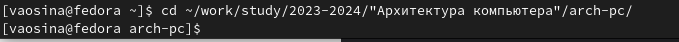
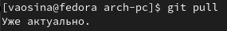
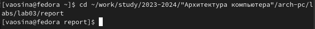
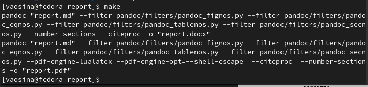
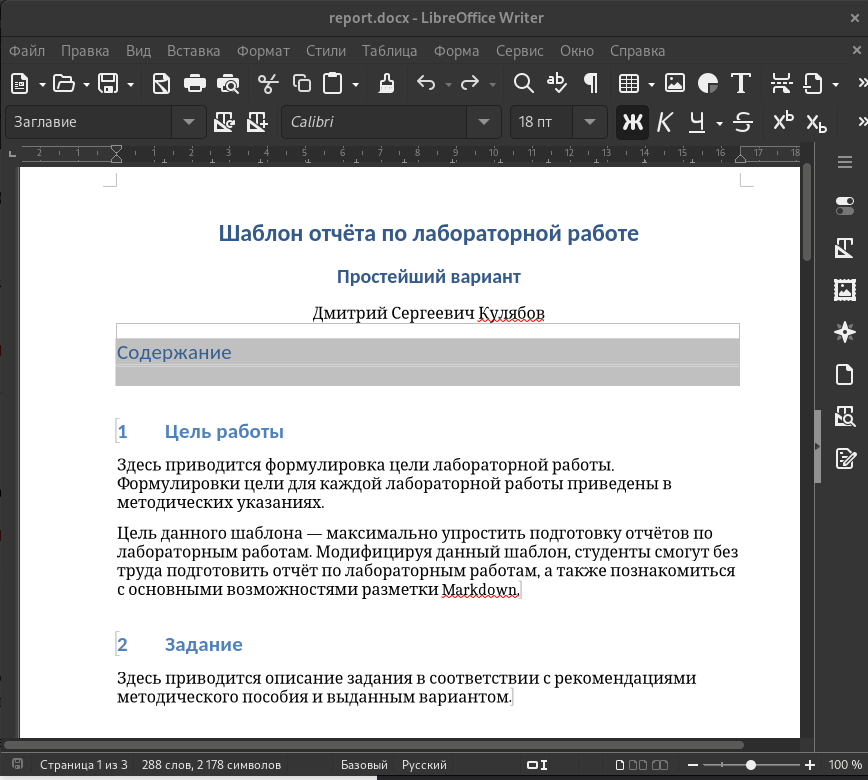
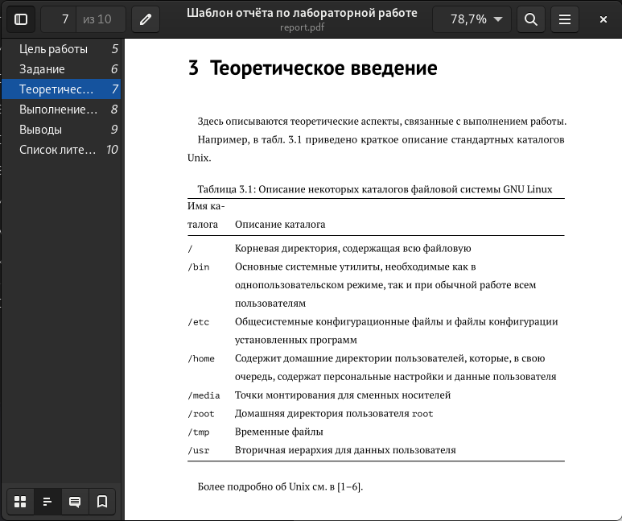
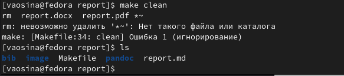
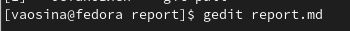
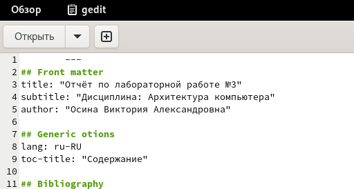

---
## Front matter
title: "Отчёт по лабораторной работе №3"
subtitle: "Дисциплина: Архитектура компьютера"
author: "Осина Виктория Александровна"

## Generic otions
lang: ru-RU
toc-title: "Содержание"

## Bibliography
bibliography: bib/cite.bib
csl: pandoc/csl/gost-r-7-0-5-2008-numeric.csl

## Pdf output format
toc: true # Table of contents
toc-depth: 2
lof: true # List of figures
lot: true # List of tables
fontsize: 12pt
linestretch: 1.5
papersize: a4
documentclass: scrreprt
## I18n polyglossia
polyglossia-lang:
  name: russian
  options:
	- spelling=modern
	- babelshorthands=true
polyglossia-otherlangs:
  name: english
## I18n babel
babel-lang: russian
babel-otherlangs: english
## Fonts
mainfont: PT Serif
romanfont: PT Serif
sansfont: PT Sans
monofont: PT Mono
mainfontoptions: Ligatures=TeX
romanfontoptions: Ligatures=TeX
sansfontoptions: Ligatures=TeX,Scale=MatchLowercase
monofontoptions: Scale=MatchLowercase,Scale=0.9
## Biblatex
biblatex: true
biblio-style: "gost-numeric"
biblatexoptions:
  - parentracker=true
  - backend=biber
  - hyperref=auto
  - language=auto
  - autolang=other*
  - citestyle=gost-numeric
## Pandoc-crossref LaTeX customization
figureTitle: "Рис."
tableTitle: "Таблица"
listingTitle: "Листинг"
lofTitle: "Список иллюстраций"
lotTitle: "Список таблиц"
lolTitle: "Листинги"
## Misc options
indent: true
header-includes:
  - \usepackage{indentfirst}
  - \usepackage{float} # keep figures where there are in the text
  - \floatplacement{figure}{H} # keep figures where there are in the text
---

# Цель работы

Целью работы является освоение процедуры оформления отчётов при помощи легковесного языка разметки Markdown.

# Задание

1. Установка необходимого ПО (TexLive и Pandoc)
2. Заполнение отчёта по лабораторной работе №3 при помощи Markdown
3. Выполнение заданий для самостоятельной работы
3. В соответствующем каталоге сделать отчёт по лабораторной работе №2 при помощи языка разметки Markdown. Предоставить отчёты в 3 форматах: pdf, docx и md
3. Загрузить файлы на github.

# Теоретическое введение

Markdown - легковесный язык разметки, 

Синтаксис Markdown для встроенной ссылки состоит из части [link text], представляю-
щей текст гиперссылки, и части (file-name.md) – URL-адреса или имени файла, на который
дается ссылка:
[link text](file-name.md)
или
>[link text](http://example.com/ "Необязательная подсказка")

Markdown поддерживает как встраивание фрагментов кода в предложение, так и их разме-
щение между предложениями в виде отдельных огражденных блоков. Огражденные блоки
кода — это простой способ выделить синтаксис для фрагментов кода. Общий формат ограж-
денных блоков кода:

>``` language
>your code goes in here
>```


# Выполнение лабораторной работы

Открываю терминал и перехожу в каталог курса, сформированный при выполнении лабораторной работы №2 (рис. [-@fig:fig1])

{#fig:fig1 width=70% }

Обновляю локальный репозиторий, скачав изменения из удаленного репозитория с помощью команды git pull (рис. [-@fig:fig2])

{#fig:fig2 width=70% }

Перехожу в каталог с шаблоном отчета по лабораторной работе №3 (рис. [-@fig:fig3])

{#fig:fig3 width=70% }

Провожу компиляцию шаблона с использованием Makefile при помощи команды make. Таким образом генерируются файлы report.pdf и report.docx. (рис. [-@fig:fig4])

{#fig:fig4 width=70% }

Открываю сгенерированные файлы и убеждаюсь в их корректности (рис. [-@fig:fig5]) и (рис. [-@fig:fig6])

{#fig:fig5 width=70% }
{#fig:fig6 width=70% }

Удаляю полученные файлы с использованием Makefile при помощи команды make clean и проверяю, что после этой команды файлы report.pdf и report.docx были удалены (рис. [-@fig:fig7])

{#fig:fig7 width=70% }

Открываю файл report.md c помощью текстового редактора gedit, изучаю структуру открытого файла (рис. [-@fig:fig8])

{#fig:fig8 width=70% }

Начинаю заполнять отчёт (рис. [-@fig:fig9])

{#fig:fig9 width=70% }


# Выводы

Здесь кратко описываются итоги проделанной работы.

# Список литературы

::: {#refs}
:::
