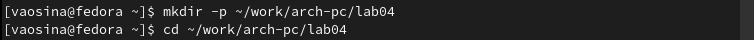

---
## Front matter
title: "Отчёт по лабораторной работе №4"
subtitle: "Дисциплина: Архитектура компьютера"
author: "Осина Виктория Александровна"

## Generic otions
lang: ru-RU
toc-title: "Содержание"

## Bibliography
bibliography: bib/cite.bib
csl: pandoc/csl/gost-r-7-0-5-2008-numeric.csl

## Pdf output format
toc: true # Table of contents
toc-depth: 2
lof: true # List of figures
lot: true # List of tables
fontsize: 12pt
linestretch: 1.5
papersize: a4
documentclass: scrreprt
## I18n polyglossia
polyglossia-lang:
  name: russian
  options:
	- spelling=modern
	- babelshorthands=true
polyglossia-otherlangs:
  name: english
## I18n babel
babel-lang: russian
babel-otherlangs: english
## Fonts
mainfont: PT Serif
romanfont: PT Serif
sansfont: PT Sans
monofont: PT Mono
mainfontoptions: Ligatures=TeX
romanfontoptions: Ligatures=TeX
sansfontoptions: Ligatures=TeX,Scale=MatchLowercase
monofontoptions: Scale=MatchLowercase,Scale=0.9
## Biblatex
biblatex: true
biblio-style: "gost-numeric"
biblatexoptions:
  - parentracker=true
  - backend=biber
  - hyperref=auto
  - language=auto
  - autolang=other*
  - citestyle=gost-numeric
## Pandoc-crossref LaTeX customization
figureTitle: "Рис."
tableTitle: "Таблица"
listingTitle: "Листинг"
lofTitle: "Список иллюстраций"
lotTitle: "Список таблиц"
lolTitle: "Листинги"
## Misc options
indent: true
header-includes:
  - \usepackage{indentfirst}
  - \usepackage{float} # keep figures where there are in the text
  - \floatplacement{figure}{H} # keep figures where there are in the text
---

# Цель работы

Целью данной работы является освоение процедуры компиляции и сборки программ, написанных на ассемблере NASM.

# Задание

1. Создание программы Hello world!
2. Компиляция текста программы при помощи транслятора NASM 
3. Работа с расширенным синтаксисом командной строки NASM 
4. Передача объектного файла на обработку компановщику LD
5. Запуска исполняемого файла 
6. Задания для самостоятельной работы

# Теоретическое введение

	Язык ассемблера (assembly language, сокращённо asm) — машинно-ориентированный язык низкого уровня. Можно считать, что он больше любых других языков приближен к архитектуре ЭВМ и её аппаратным возможностям, что позволяет получить к ним более полный доступ, нежели в языках высокого уровня, таких как C/C++, Perl, Python и пр. Заметим, что получить полный доступ к ресурсам компьютера в современных архитектурах нельзя, самым низким уровнем работы прикладной программы является обращение напрямую к ядру операционной системы. Именно на этом уровне и работают программы, написанные на ассемблере. Но в отличие от языков высокого уровня ассемблерная программа содержит только тот код, который ввёл программист. Таким образом язык ассемблера — это язык, с помощью которого понятным для человека образом пишутся команды для процессора.
	Следует отметить, что процессор понимает не команды ассемблера, а последовательности из нулей и единиц — машинные коды. До появления языков ассемблера программистам приходилось писать программы, используя только лишь машинные коды, которые были крайне сложны для запоминания, так как представляли собой числа, записанные в двоичной или шестнадцатеричной системе счисления. Преобразование или трансляция команд с языка ассемблера в исполняемый машинный код осуществляется специальной программой транслятором — Ассемблер.
	Программы, написанные на языке ассемблера, не уступают в качестве и скорости программам, написанным на машинном языке, так как транслятор просто переводит мнемонические обозначения команд в последовательности бит (нулей и единиц).
	Используемые мнемоники обычно одинаковы для всех процессоров одной архитектуры или семейства архитектур (среди широко известных — мнемоники процессоров и контроллеров x86, ARM, SPARC, PowerPC,M68k). Таким образом для каждой архитектуры существует свой ассемблер и, соответственно, свой язык ассемблера.
	Наиболее распространёнными ассемблерами для архитектуры x86 являются:
• для DOS/Windows: Borland Turbo Assembler (TASM), Microsoft Macro Assembler (MASM) и Watcom assembler (WASM);
• для GNU/Linux: gas (GNU Assembler), использующий AT&T-синтаксис, в отличие от большинства других популярных ассемблеров, которые используют Intel-синтаксис.

	NASM — это открытый проект ассемблера, версии которого доступны под различные операционные системы и который позволяет получать объектные файлы для этих систем. В NASM используется Intel-синтаксис и поддерживаются инструкции x86-64.
	Типичный формат записи команд NASM имеет вид:
[метка:] мнемокод [операнд {, операнд}] [; комментарий]
	Здесь мнемокод — непосредственно мнемоника инструкции процессору, которая является обязательной частью команды. Операндами могут быть числа, данные, адреса регистров или адреса оперативной памяти. Метка — это идентификатор, с которым ассемблер ассоциирует некоторое число, чаще всего адрес в памяти. Т.о. метка перед командой связана с адресом данной команды.
	Допустимыми символами в метках являются буквы, цифры, а также следующие символы:
_, $, #, @,~,. и ?.
	Начинаться метка или идентификатор могут с буквы, ., _ и ?. Перед идентификаторами, которые пишутся как зарезервированные слова, нужно писать $, чтобы компилятор трактовал его верно (так называемое экранирование). Максимальная длина идентификатора 4095 символов.
	Программа на языке ассемблера также может содержать директивы — инструкции, не переводящиеся непосредственно в машинные команды, а управляющие работой транслятора. Например, директивы используются для определения данных (констант и переменных) и обычно пишутся большими буквами.

# Выполнение лабораторной работы
## Программа Hello world!
Создаю каталог для работы с программами на языке ассемблера NASM и перехожу в созданный каталог(рис. [-@fig:001])

{#fig:001 width=70%}

Создаю текстовый файл с именем hello.asm (рис. [-@fig:002])

{#fig:002 width=70%}

Открываю этот файл с помощью текстового редактора gedit (рис. [-@fig:003])

{#fig:003 width=70%}

и ввожу в него необходимый текст (рис. [-@fig:004])

{#fig:004 width=70%}

## Транслятор NASM

Для компиляции текста программы «Hello World» пишу следующую команду (рис. [-@fig:005])

{#fig:005 width=70%}

С помощью команды ls проверяю, что объектный файл был создан. Файл создается в формате ELF (рис. [-@fig:006])

{#fig:006 width=70%}

## Расширенный синтаксис командной строки NASM

Выполняю следующую команду: (рис. [-@fig:007])

{#fig:007 width=70%}

С помощью команды ls проверяю, что файл был создан (рис. [-@fig:008])

{#fig:008 width=70%}

## Компоновщик LD

Чтобы получить исполняемую программу, передаю объектный файл на обработку компоновщику LD (рис. [-@fig:009])

{#fig:009 width=70%}

С помощью команды ls проверяю, что исполняемый файл hello был создан. (рис. [-@fig:010])

{#fig:010 width=70%}

Выполняю следующую команду: (рис. [-@fig:011])

{#fig:011 width=70%}

Исполняемый файл имеет имя main, объектный файл имеет имя obj.o 

## Запуск исполняемого файла

Запускаю на выполнение созданный исполняемый файл, находящийся в текущем каталоге, при помощи команды ./hello  (рис. [-@fig:012])

{#fig:012 width=70%}

## Задание для самостоятельной работы

В каталоге ~/work/arch-pc/lab04 с помощью команды cp создаю копию файла hello.asm с именем lab4.asm (рис. [-@fig:013])

{#fig:013 width=70%}

С помощью текстового редактора gedit вношу изменения в текст программы в файле lab4.asm так, чтобы вместо Hello world! на экран выводилась строка с моими фамилией и именем (рис. [-@fig:014])

{#fig:014 width=70%}

Транслирую полученный текст программы lab4.asm в объектный файл (рис. [-@fig:015])

{#fig:015 width=70%}

Выполняю компоновку объектного файла (рис. [-@fig:016])

{#fig:016 width=70%}

Запускаю получившийся исполняемый файл (рис. [-@fig:017])

{#fig:017 width=70%}

Копирую файлы hello.asm и lab4.asm в мой локальный репозиторий в каталог ~/work/study/2023-2024/"Архитектура компьютера"/arch-pc/labs/lab04/. (рис. [-@fig:018]), (рис. [-@fig:019]) и (рис. [-@fig:020])

{#fig:018 width=70%}

{#fig:019 width=70%}

{#fig:020 width=70%}

Загружаю файлы на Github (рис. [-@fig:021])

{#fig:021 width=70%}

# Выводы

Я освоила процедуру компиляции и сборки программ, написанных на ассемблере NASM

# Список литературы

::: [Архитектура ЭВМ - Лабораторная работа №4](https://esystem.rudn.ru/pluginfile.php/2089084/mod_resource/content/0/%D0%9B%D0%B0%D0%B1%D0%BE%D1%80%D0%B0%D1%82%D0%BE%D1%80%D0%BD%D0%B0%D1%8F%20%D1%80%D0%B0%D0%B1%D0%BE%D1%82%D0%B0%20%E2%84%964.%20%D0%A1%D0%BE%D0%B7%D0%B4%D0%B0%D0%BD%D0%B8%D0%B5%20%D0%B8%20%D0%BF%D1%80%D0%BE%D1%86%D0%B5%D1%81%D1%81%20%D0%BE%D0%B1%D1%80%D0%B0%D0%B1%D0%BE%D1%82%D0%BA%D0%B8%20%D0%BF%D1%80%D0%BE%D0%B3%D1%80%D0%B0%D0%BC%D0%BC%20%D0%BD%D0%B0%20%D1%8F%D0%B7%D1%8B%D0%BA%D0%B5%20%D0%B0%D1%81%D1%81%D0%B5%D0%BC%D0%B1%D0%BB%D0%B5%D1%80%D0%B0%20NASM.pdf)
:::
