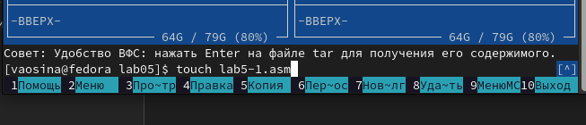
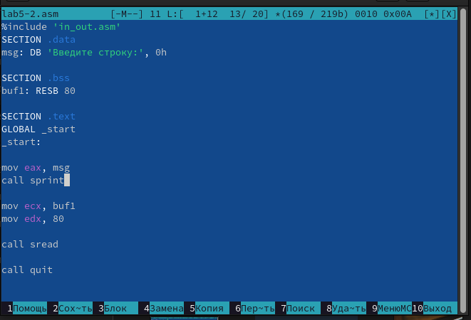
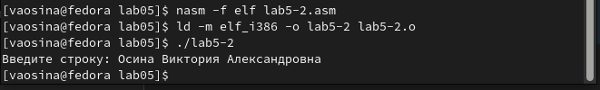

---
## Front matter
title: "Отчёт по лабораторной работе №5"
subtitle: "Дисциплина: Архитектура компьютера"
author: "Осина Виктория Александровна"

## Generic otions
lang: ru-RU
toc-title: "Содержание"

## Bibliography
bibliography: bib/cite.bib
csl: pandoc/csl/gost-r-7-0-5-2008-numeric.csl

## Pdf output format
toc: true # Table of contents
toc-depth: 2
lof: true # List of figures
lot: true # List of tables
fontsize: 12pt
linestretch: 1.5
papersize: a4
documentclass: scrreprt
## I18n polyglossia
polyglossia-lang:
  name: russian
  options:
	- spelling=modern
	- babelshorthands=true
polyglossia-otherlangs:
  name: english
## I18n babel
babel-lang: russian
babel-otherlangs: english
## Fonts
mainfont: PT Serif
romanfont: PT Serif
sansfont: PT Sans
monofont: PT Mono
mainfontoptions: Ligatures=TeX
romanfontoptions: Ligatures=TeX
sansfontoptions: Ligatures=TeX,Scale=MatchLowercase
monofontoptions: Scale=MatchLowercase,Scale=0.9
## Biblatex
biblatex: true
biblio-style: "gost-numeric"
biblatexoptions:
  - parentracker=true
  - backend=biber
  - hyperref=auto
  - language=auto
  - autolang=other*
  - citestyle=gost-numeric
## Pandoc-crossref LaTeX customization
figureTitle: "Рис."
tableTitle: "Таблица"
listingTitle: "Листинг"
lofTitle: "Список иллюстраций"
lotTitle: "Список таблиц"
lolTitle: "Листинги"
## Misc options
indent: true
header-includes:
  - \usepackage{indentfirst}
  - \usepackage{float} # keep figures where there are in the text
  - \floatplacement{figure}{H} # keep figures where there are in the text
---

# Цель работы

Целью работы является приобретение практических навыков работы в Midnight Commander и освоение инструкций
языка ассемблера mov и int.

# Задания

1. Создание каталога и файла, с которыми будет вестись дальнейшая работа
2. Освоение программы вывода сообщения на экран и ввода строки с клавиатуры
3. Подключение внешнего файла in_out.asm
4. Выполнение заданий для самостоятельной работы

# Теоретическое введение

	Midnight Commander (или просто mc) — это программа, которая позволяет просматривать структуру каталогов и выполнять основные операции по управлению файловой системой, т.е. mc является файловым менеджером.
Midnight Commander позволяет сделать работу с файлами более удобной и наглядной. Для активации оболочки Midnight Commander достаточно ввести в командной строке mc и нажать клавишу Enter.
	В Midnight Commander используются функциональные клавиши F1 — F10, к которым привязаны часто выполняемые операции.
	Программа на языке ассемблера NASM, как правило, состоит из трёх секций: секция кода программы (SECTION .text), секция инициированных (известных во время компиляции) данных (SECTION .data) и секция неинициализированных данных
(тех, под которые во время компиляции только отводится память, а значение присваивается в ходе выполнения программы) (SECTION .bss).	
	Для объявления инициированных данных в секции .data используются директивы DB, DW, DD, DQ и DT, которые резервируют память и указывают, какие значения должны храниться в этой памяти. Директивы используются для объявления
простых переменных и для объявления массивов. Для определения строк принято использовать директиву DB в связи с особенностями хранения данных в оперативной памяти. Для объявления неинициированных данных в секции .bss используются
директивы resb, resw, resd и другие, которые сообщают ассемблеру, что необходимо зарезервировать заданное количество ячеек памяти. 
	Инструкция языка ассемблера mov предназначена для дублирования данных источника в приёмнике. В общем виде эта инструкция записывается в виде
> mov dst,src

Здесь операнд dst — приёмник, а src — источник. В качестве операнда могут выступать регистры (register), ячейки памяти (memory) и непосредственные значения (const).
Переслать значение из одной ячейки памяти в другую нельзя, для этого необходимо использовать две инструкции mov:
>mov eax, x
>mov y, eax

Также необходимо учитывать то, что размер операндов приемника и источника должны совпадать.
	Инструкция языка ассемблера int предназначена для вызова прерывания с указанным номером. В общем виде она записывается в виде
> int n

Здесь n — номер прерывания, принадлежащий диапазону 0–255.
	После вызова инструкции int 80h выполняется системный вызов какой-либо функции ядра Linux. При этом происходит передача управления ядру операционной системы. Чтобы узнать, какую именно системную функцию нужно выполнить, ядро извлекает номер системного вызова из регистра eax. Поэтому перед вызовом прерывания необходимо поместить в этот регистр нужный номер. Кроме того, многим системным функциям требуется передавать какие-либо параметры. По принятым в ОС Linux правилам эти параметры помещаются в порядке следования в остальные регистры процессора: ebx, ecx, edx. Если системная функция должна вернуть значение, то она помещает его в регистр eax.
	
# Выполнение лабораторной работы
## Создание каталога и файла, с которыми будет вестись дальнейшая работа

Открываю Midnight Commander (рис. @fig:001) и (рис. @fig:002).

{#fig:001 width=70%}

{#fig:002 width=70%}

Пользуясь клавишами ↑, ↓ и Enter перехожу в каталог ~/work/arch-pc, созданный при выполнении лабораторной работы №4 (рис. @fig:003).

{#fig:003 width=70%}

С помощью функциональной клавиши F7 создаю каталог lab05 и перехожу в него (рис. @fig:004).

{#fig:004 width=70%}

Пользуясь строкой ввода и командой touch создаю файл lab5-1.asm (рис. @fig:005).

{#fig:005 width=70%}

## Освоение программы вывода сообщения на экран и ввода строки с клавиатуры

С помощью функциональной клавиши F4 открываю файл lab5-1.asm для редактирования во встроенном редакторе (рис. @fig:006).

{#fig:006 width=70%}

Ввожу текст программы, сохраняю изменения и закрываю файл. (рис. @fig:007) и (рис. @fig:008).

{#fig:007 width=70%}

{#fig:008 width=70%}

С помощью функциональной клавиши F3 открываю файл lab5-1.asm для просмотра. Убеждаюсь, что файл содержит текст программы. (рис. @fig:009).

{#fig:009 width=70%}

Транслирую текст программы lab5-1.asm в объектный файл. Выполняю компоновку объектного файла и запускаю получившийся исполняемый файл. Программа выводит строку 'Введите строку:' и ожидает ввода с клавиатуры. На запрос ввожу свои ФИО (рис. @fig:010) и (рис. @fig:011).

{#fig:010 width=70%}

{#fig:011 width=70%}

## Подключение внешнего файла in_out.asm

Скачиваю файл in_out.asm. В одной из панелей mc открываю каталог с файлом lab5-1.asm. В другой панели каталог со скаченным файлом in_out.asm (для перемещения между панелями использую Tab ) (рис. @fig:012).

{#fig:012 width=70%}

Копирую файл in_out.asm в каталог с файлом lab5-1.asm с помощью функциональной клавиши F5  (рис. @fig:013).

{#fig:013 width=70%}

Убеждаюсь, что файл in_out.asm теперь находится в нужном каталоге (рис. @fig:014).

{#fig:014 width=70%}

С помощью функциональной клавиши F5 создаю копию файла lab5-1.asm с именем lab5-2.asm и убеждаюсь в том, что скопированный файл есть в каталоге (рис. @fig:015) (рис. @fig:016).

{#fig:015 width=70%}

{#fig:016 width=70%}

Исправляю текст программы в файле lab5-2.asm с использованием подпрограмм из внешнего файла in_out.asm (использую подпрограммы sprintLF, sread и quit) (рис. @fig:017).

{#fig:017 width=70%}

Создаю исполняемый файл и проверяю его работу. (рис. @fig:018).

{#fig:018 width=70%}

В файле lab5-2.asm заменяю подпрограмму sprintLF на sprint. Создаю исполняемый файл и проверяю его работу (рис. @fig:019) и (рис. @fig:020).

{#fig:019 width=70%}

{#fig:020 width=70%}

Разница в том, что подкомманда sprintLF при выводе на экран добавляет к сообщению символ перевода строки, а sprint не добавляет, поэтому во втором случае ввод осуществляется на той же строке, где было выведено сообщение.  

## Выполнение заданий для самостоятельной работы 

Создаю копию файла lab5-1.asm и называю её lab5-1-1.asm (рис. @fig:021).

{#fig:021 width=70%}

Вношу изменения в программу (без использования внешнего файла in_out.asm), так чтобы она работала по следующему алгоритму:
* вывести приглашение типа “Введите строку:”;
* ввести строку с клавиатуры;
* вывести введённую строку на экран 
(рис. @fig:022).

{#fig:022 width=70%}

Получаю исполняемый файл и проверяю его работу. На приглашение ввести строку ввожу свои ФИО (рис. @fig:023).

{#fig:023 width=70%}

Создаю копию файла lab5-2.asm и называю её lab5-2-2.asm (рис. @fig:024) и (рис. @fig:025).

{#fig:024 width=70%}

{#fig:025 width=70%}

Исправляю текст программы с использование подпрограмм из внешнего файла in_out.asm, так чтобы она работала по следующему алгоритму:
* вывести приглашение типа “Введите строку:”;
* ввести строку с клавиатуры;
* вывести введённую строку на экран. 
(рис. @fig:028).

{#fig:028 width=70%}

Создаю исполняемый файл и проверяю его работу.(рис. @fig:026) и (рис. @fig:027).

{#fig:026 width=70%}

{#fig:027 width=70%}

# Выводы

Я приобрела практические навыки работы в Midnight Commander и освоила инструкции языка ассемблера mov и int.

# Список литературы

1. [Архитектура ЭВМ](https://esystem.rudn.ru/pluginfile.php/2089085/mod_resource/content/0/%D0%9B%D0%B0%D0%B1%D0%BE%D1%80%D0%B0%D1%82%D0%BE%D1%80%D0%BD%D0%B0%D1%8F%20%D1%80%D0%B0%D0%B1%D0%BE%D1%82%D0%B0%20%E2%84%965.%20%D0%9E%D1%81%D0%BD%D0%BE%D0%B2%D1%8B%20%D1%80%D0%B0%D0%B1%D0%BE%D1%82%D1%8B%20%D1%81%20Midnight%20Commander%20%28%29.%20%D0%A1%D1%82%D1%80%D1%83%D0%BA%D1%82%D1%83%D1%80%D0%B0%20%D0%BF%D1%80%D0%BE%D0%B3%D1%80%D0%B0%D0%BC%D0%BC%D1%8B%20%D0%BD%D0%B0%20%D1%8F%D0%B7%D1%8B%D0%BA%D0%B5%20%D0%B0%D1%81%D1%81%D0%B5%D0%BC%D0%B1%D0%BB%D0%B5%D1%80%D0%B0%20NASM.%20%D0%A1%D0%B8%D1%81%D1%82%D0%B5%D0%BC%D0%BD%D1%8B%D0%B5%20%D0%B2%D1%8B%D0%B7%D0%BE%D0%B2%D1%8B%20%D0%B2%20%D0%9E%D0%A1%20GNU%20Linux.pdf)
