---
## Front matter
title: "Отчёт по лабораторной работе №6"
subtitle: "Дисциплина: Архитектура компьютера"
author: "Осина Виктория Александровна"

## Generic otions
lang: ru-RU
toc-title: "Содержание"

## Bibliography
bibliography: bib/cite.bib
csl: pandoc/csl/gost-r-7-0-5-2008-numeric.csl

## Pdf output format
toc: true # Table of contents
toc-depth: 2
lof: true # List of figures
lot: true # List of tables
fontsize: 12pt
linestretch: 1.5
papersize: a4
documentclass: scrreprt
## I18n polyglossia
polyglossia-lang:
  name: russian
  options:
	- spelling=modern
	- babelshorthands=true
polyglossia-otherlangs:
  name: english
## I18n babel
babel-lang: russian
babel-otherlangs: english
## Fonts
mainfont: PT Serif
romanfont: PT Serif
sansfont: PT Sans
monofont: PT Mono
mainfontoptions: Ligatures=TeX
romanfontoptions: Ligatures=TeX
sansfontoptions: Ligatures=TeX,Scale=MatchLowercase
monofontoptions: Scale=MatchLowercase,Scale=0.9
## Biblatex
biblatex: true
biblio-style: "gost-numeric"
biblatexoptions:
  - parentracker=true
  - backend=biber
  - hyperref=auto
  - language=auto
  - autolang=other*
  - citestyle=gost-numeric
## Pandoc-crossref LaTeX customization
figureTitle: "Рис."
tableTitle: "Таблица"
listingTitle: "Листинг"
lofTitle: "Список иллюстраций"
lotTitle: "Список таблиц"
lolTitle: "Листинги"
## Misc options
indent: true
header-includes:
  - \usepackage{indentfirst}
  - \usepackage{float} # keep figures where there are in the text
  - \floatplacement{figure}{H} # keep figures where there are in the text
---

# Цель работы

Целью данной лабораторной работы является освоение арифметических инструкций языка ассемблера NASM.

# Задание

1. Освоение вывода символьных и численных значений.
2. Выполнение арифметических операций.
3. Выполнение задания для самостоятельной работы.

# Теоретическое введение

Большинство инструкций на языке ассемблера требуют обработки операндов. Адрес опе-
ранда предоставляет место, где хранятся данные, подлежащие обработке. Это могут быть
данные хранящиеся в регистре или в ячейке памяти. Далее рассмотрены все существующие
способы задания адреса хранения операндов – способы адресации.
Существует три основных способа адресации:
• Регистровая адресация – операнды хранятся в регистрах и в команде используются
имена этих регистров, например: mov ax,bx.
• Непосредственная адресация – значение операнда задается непосредственно в ко-
манде, Например: mov ax,2.
• Адресация памяти – операнд задает адрес в памяти. В команде указывается символи-
ческое обозначение ячейки памяти, над содержимым которой требуется выполнить
операцию.

Схема команды целочисленного сложения add (от англ. addition - добавление) выполняет
сложение двух операндов и записывает результат по адресу первого операнда. Команда add
работает как с числами со знаком, так и без знака.

Команда целочисленного вычитания sub (от англ. subtraction – вычитание) работает анало-
гично команде add.

Прибавление единицы называется инкрементом, а вычитание — декрементом.
Для этих операций существуют специальные команды: inc (от англ. increment) и dec (от англ.
decrement), которые увеличивают и уменьшают на 1 свой операнд.

Команда neg рассматривает свой операнд как число со знаком и меняет знак операнда на
противоположный. 

Умножение и деление, в отличии от сложения и вычитания, для знаковых и беззнаковых
чисел производиться по-разному, поэтому существуют различные команды.
Для беззнакового умножения используется команда mul (от англ. multiply – умножение)
Для знакового умножения используется команда imul.

Для деления, как и для умножения, существует 2 команды div (от англ. divide - деление) и
idiv.

для преобразования ASCII символов в числа и обратно реализованы следующие подпрограммы:
• iprint – вывод на экран чисел в формате ASCII, перед вызовом iprint в регистр eax
необходимо записать выводимое число (mov eax,<int>).
• iprintLF – работает аналогично iprint, но при выводе на экран после числа добавляет
к символ перевода строки.
• atoi – функция преобразует ascii-код символа в целое число и записает результат
в регистр eax, перед вызовом atoi в регистр eax необходимо записать число (mov
eax,<int>).

# Выполнение лабораторной работы
## Освоение вывода символьных и численных значений

Создаю каталог для программ лабораторной работы №6, перехожу в него и создаю файл lab6-1.asm (рис. @fig:001)

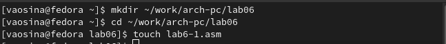{#fig:001 width=70%}

Перед работой с программами копирую файл in_out.asm в каталог(рис. @fig:002) (рис. @fig:003)

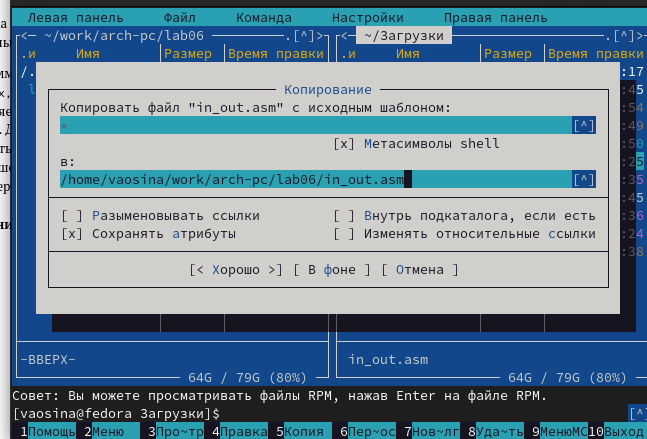{#fig:002 width=70%}

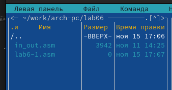{#fig:003 width=70%}

Ввожу в файл lab6-1.asm текст программы (рис. @fig:004).

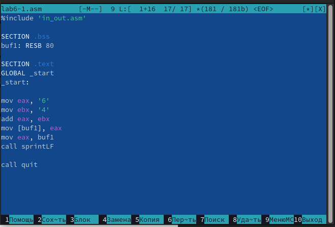{#fig:004 width=70%}

Создаю исполняемый файл и запускаю его (рис. @fig:005).
В данном случае при выводе значения регистра eax мы ожидаем увидеть число 10. Однако
результатом будет символ j. Это происходит потому, что код символа 6 равен 00110110 в
двоичном представлении (или 54 в десятичном представлении), а код символа 4 – 00110100 
(52). Команда add eax,ebx запишет в регистр eax сумму кодов – 01101010 (106), что в свою
очередь является кодом символа j 

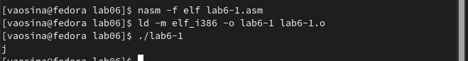{#fig:005 width=70%}

Изменяю текст программы и вместо символов, записываю в регистры числа (рис. @fig:006).

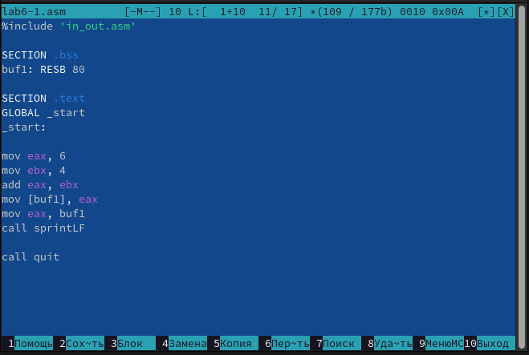{#fig:006 width=70%}

Создаю исполняемый файл и запускаю его. (рис. @fig:007)
Как и в предыдущем случае при исполнении программы мы не получим число 10. В данном
случае выводится символ с кодом 10, при этом этот символ не отображается при выводе на экран.
Код 10 соответствует символу переноса строки

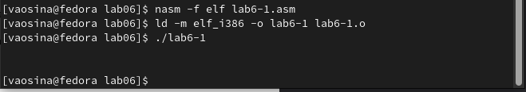{#fig:007 width=70%}

Создаю файл lab6-2.asm в каталоге ~/work/arch-pc/lab06 и ввожу в него текст про-
граммы (рис. @fig:081) (рис. @fig:008).

{#fig:081 width=70%}

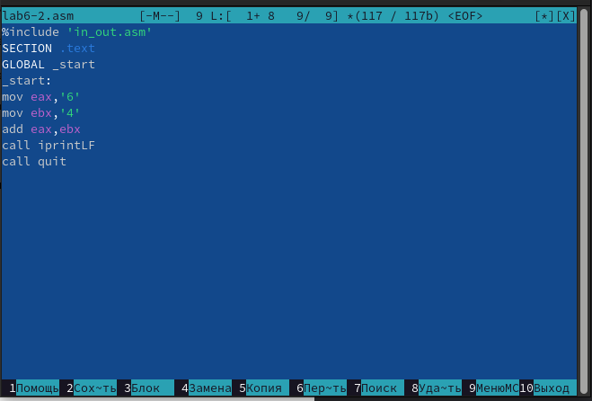{#fig:008 width=70%}

Создаю исполняемый файл и запускаю его. (рис. @fig:009).
В результате работы программы получаем число 106. В данном случае, как и в первом,
команда add складывает коды символов ‘6’ и ‘4’ (54+52=106). Однако функция iprintLF 
позволяет вывести число, а не символ, кодом которого
является это число.

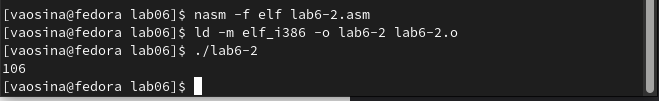{#fig:009 width=70%}

Изменяю текст программы и вместо символов, записываю в регистры числа (рис. @fig:111) 
Создаю исполняемый файл и запускаю его. (рис. @fig:112).
Программа складывает не коды символов, а сами числа, поэтому в результате работы 
программы получаем 10.

{#fig:010 width=70%}

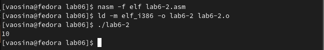{#fig:011 width=70%}

Заменяю функцию iprintLF на iprint. (рис. @fig:010) 

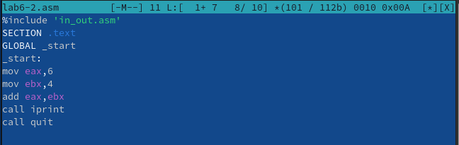{#fig:010 width=70%}

Создаю исполняемый файл и запускаю его. (рис. @fig:011) 
Вывод функций iprintLF и iprint отличается тем, что функция iprintLF после числа добавляет символ переноса строки, а iprint нет.

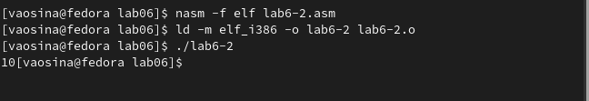{#fig:011 width=70%}

## Выполнение арифметических операций

Создаю файл lab6-3.asm в каталоге ~/work/arch-pc/lab06 (рис. @fig:012).

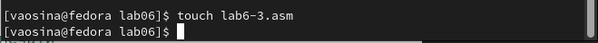{#fig:012 width=70%}

Ввожу текст программы для вычисления арифметического выражения 𝑓(𝑥) = (5*2+3)/3.(рис. @fig:013).

{#fig:013 width=70%}

Создаю исполняемый файл и запускаю его. (рис. @fig:014).

{#fig:014 width=70%}

Изменяю текст программы для вычисления выражения 𝑓(𝑥) = (4*6+2)/5 (рис. @fig:015) 

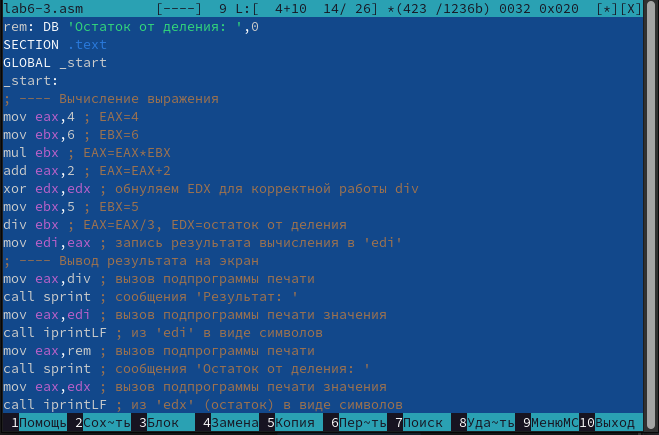{#fig:015 width=70%}

Создаю исполняемый файл и запускаю его. (рис. @fig:016).

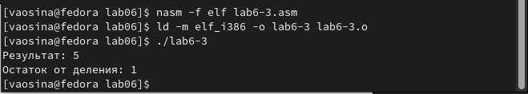{#fig:016 width=70%}

Создаю файл variant.asm в каталоге ~/work/arch-pc/lab06 (рис. @fig:113).
Ввожу текст программы для вычисления варианта задания по
номеру студенческого билета (рис. @fig:017)

{#fig:113 width=70%}

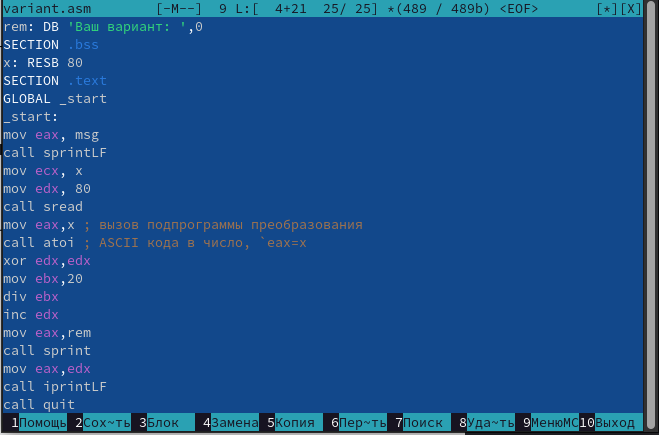{#fig:017 width=70%}

Создаю исполняемый файл и запускаю его.(рис. @fig:018)

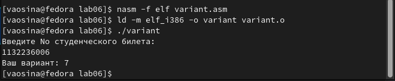{#fig:018 width=70%}

Проверяю результат работы программы
вычислив номер варианта аналитически:
1132236006 делится на 20, в остатке остается 6, к этому значению прибавляется 1, получается 7

1. Какие строки отвечают за вывод на экран сообщения ‘Ваш вариант:’?
За вывод сообщения на экран отвечают строки:

\```
mov eax,rem
call sprint
\```

2. Для чего используется следующие инструкции?

`mov ecx, x` - для того, чтобы поместить адрес вводимой строки х в регистр ecx
`mov edx, 80` - запись в регитр edx длины вводимой строки
`call sread` - вызов подпрограммы, обеспечивающей ввод сообщения с клавиатуры

3. Для чего используется инструкция `call atoi`?

Для преобразования ASCII кода в число

4. Какие строки отвечают за вычисления варианта?

За вычисление варианта отвечают:

\```
xor edx,edx
mov ebx,20
div ebx
inc edx
\```

5. В какой регистр записывается остаток от деления при выполнении инструкции `div ebx`?

Остаток от деления при выполнении функции div записывается в регистр edx

6. Для чего используется инструкция `inc edx`?

Инструкция `inc edx` используется для увеличения значения edx на 1

7. Какие строки отвечают за вывод на экран результата вычислений?

За вывод на экран результата вычислений отвечают:

\```
mov eax, edx
call iprintLF
\```


## Выполнение задания для самостоятельной работы 

Необходимо написать программу вычисления выражения 𝑦 = 𝑓(𝑥)
Согласно моему варианту, полученному при выполнении лабораторной работы, это выражение 5(𝑥−1)^2. Проверить работу программы вычисления нужно, используя значение переменных х1 (3) и х2 (5).

Создаю файл var7.asm в каталоге ~/work/arch-pc/lab06 (рис. @fig:019)

{#fig:019 width=70%}

Ввожу текст программы (рис. @fig:020).

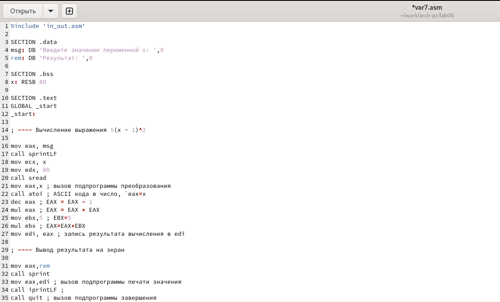{#fig:020 width=70%}

Создаю исполняемый файл и запускаю его. Проверяю работу программы, испульзуя сначала х1 = 3, а затем х2 = 5 (рис. @fig:021).

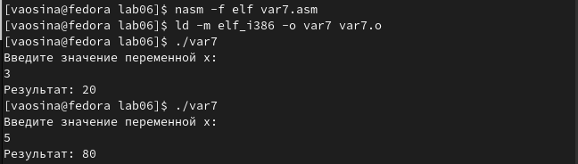{#fig:021 width=70%}

Действительно, если подставить 3, то 5*(3-1)^2 = 5*2^2  5*4 = 20.
Если подставить 5: 5*(5-1)^2 = 5*4^2 = 5*16= 80.


# Выводы

При выполнении лабораторной работы я освоила арифметические инструкции языка ассемблера NASM.

# Список литературы

1. [Архитектура ЭВМ](https://esystem.rudn.ru/pluginfile.php/2089086/mod_resource/content/0/%D0%9B%D0%B0%D0%B1%D0%BE%D1%80%D0%B0%D1%82%D0%BE%D1%80%D0%BD%D0%B0%D1%8F%20%D1%80%D0%B0%D0%B1%D0%BE%D1%82%D0%B0%20%E2%84%966.%20%D0%90%D1%80%D0%B8%D1%84%D0%BC%D0%B5%D1%82%D0%B8%D1%87%D0%B5%D1%81%D0%BA%D0%B8%D0%B5%20%D0%BE%D0%BF%D0%B5%D1%80%D0%B0%D1%86%D0%B8%D0%B8%20%D0%B2%20NASM..pdf)


