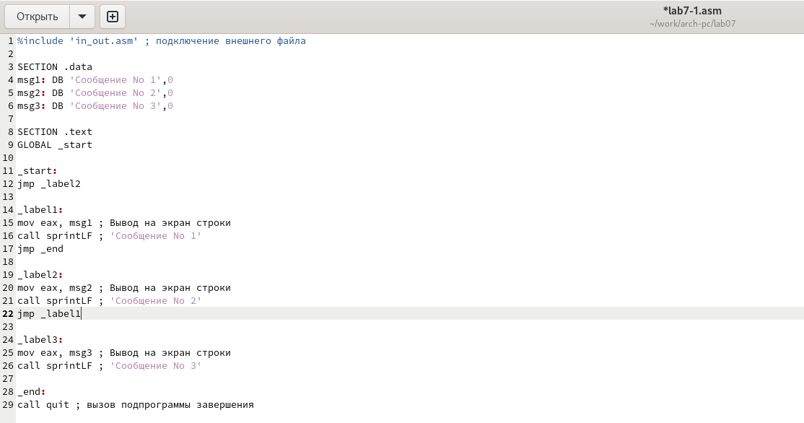
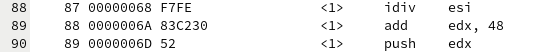
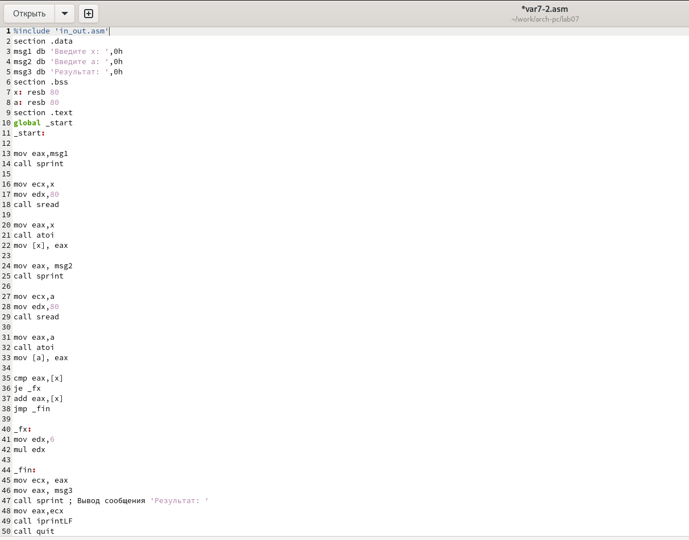

---
## Front matter
title: "Шаблон отчёта по лабораторной работе"
subtitle: "Простейший вариант"
author: "Дмитрий Сергеевич Кулябов"

## Generic otions
lang: ru-RU
toc-title: "Содержание"

## Bibliography
bibliography: bib/cite.bib
csl: pandoc/csl/gost-r-7-0-5-2008-numeric.csl

## Pdf output format
toc: true # Table of contents
toc-depth: 2
lof: true # List of figures
lot: true # List of tables
fontsize: 12pt
linestretch: 1.5
papersize: a4
documentclass: scrreprt
## I18n polyglossia
polyglossia-lang:
  name: russian
  options:
	- spelling=modern
	- babelshorthands=true
polyglossia-otherlangs:
  name: english
## I18n babel
babel-lang: russian
babel-otherlangs: english
## Fonts
mainfont: PT Serif
romanfont: PT Serif
sansfont: PT Sans
monofont: PT Mono
mainfontoptions: Ligatures=TeX
romanfontoptions: Ligatures=TeX
sansfontoptions: Ligatures=TeX,Scale=MatchLowercase
monofontoptions: Scale=MatchLowercase,Scale=0.9
## Biblatex
biblatex: true
biblio-style: "gost-numeric"
biblatexoptions:
  - parentracker=true
  - backend=biber
  - hyperref=auto
  - language=auto
  - autolang=other*
  - citestyle=gost-numeric
## Pandoc-crossref LaTeX customization
figureTitle: "Рис."
tableTitle: "Таблица"
listingTitle: "Листинг"
lofTitle: "Список иллюстраций"
lotTitle: "Список таблиц"
lolTitle: "Листинги"
## Misc options
indent: true
header-includes:
  - \usepackage{indentfirst}
  - \usepackage{float} # keep figures where there are in the text
  - \floatplacement{figure}{H} # keep figures where there are in the text
---

# Цель работы

Целью данной лабораторной работы является
изучение команд условного и безусловного переходов, приобретение навыков написания
программ с использованием переходов, а также знакомство с назначением и структурой файла
листинга.

# Задание

1. Реализация переходов в NASM
2. Изучение структуры файлы листинга
3. Задание для самостоятельной работы

# Теоретическое введение

Для реализации ветвлений в ассемблере используются так называемые команды передачи
управления или команды перехода. Можно выделить 2 типа переходов:
• условный переход – выполнение или не выполнение перехода в определенную точку
программы в зависимости от проверки условия.
• безусловный переход – выполнение передачи управления в определенную точку про-
граммы без каких-либо условий.

Безусловный переход выполняется инструкцией jmp (от англ. jump – прыжок), которая
включает в себя адрес перехода, куда следует передать управление:
`jmp <адрес_перехода>`

Для условного перехода необходима проверка какого-либо условия.
В ассемблере команды условного перехода вычисляют условие перехода анализируя флаги
из регистра флагов.
Флаг – это бит, принимающий значение 1 («флаг установлен»), если выполнено некоторое
условие, и значение 0 («флаг сброшен») в противном случае. Флаги работают независимо
друг от друга, и лишь для удобства они помещены в единый регистр — регистр флагов, отра-
жающий текущее состояние процессора. 

Инструкция cmp является одной из инструкций, которая позволяет сравнить операнды и
выставляет флаги в зависимости от результата сравнения.
Инструкция cmp является командой сравнения двух операндов и имеет такой же формат,
как и команда вычитания:
`cmp <операнд_1>, <операнд_2>`
Единственным результатом
команды сравнения является формирование флагов.

Команда условного перехода имеет вид
`j<мнемоника перехода> label`
Мнемоника перехода связана со значением анализируемых флагов или со способом фор-
мирования этих флагов.

Листинг (в рамках понятийного аппарата NASM) — это один из выходных файлов, созда-
ваемых транслятором. Он имеет текстовый вид и нужен при отладке программы, так как
кроме строк самой программы он содержит дополнительную информацию

Все ошибки и предупреждения, обнаруженные при ассемблировании, транслятор выводит
на экран, и файл листинга не создаётся.
Итак, структура листинга:
• номер строки — это номер строки файла листинга;
• адрес — это смещение машинного кода от начала текущего сегмента;
• машинный код представляет собой ассемблированную исходную строку в виде шестна-
дцатеричной последовательности.;
• исходный текст программы — это просто строка исходной программы вместе с ком-
ментариями.

# Выполнение лабораторной работы
## Реализация переходов в NASM

Создаю каталог lab07 для программ лабораторной работы №7, перехожу в него и со-
здаю файл lab7-1.asm, проверяю, что файл создан (рис. @fig:001)

{#fig:001 width=70%}

Перед работой с программами копирую файл in_out.asm в каталог и проверяю, что файл находится в нужном каталоге (рис. @fig:002) (рис. @fig:003)

{#fig:002 width=70%}

{#fig:003 width=70%}

Ввожу в файл lab7-1.asm текст программы (рис. @fig:004).

{#fig:004 width=70%}

Создаю исполняемый файл и запускаю его (рис. @fig:005).

{#fig:005 width=70%}

Изменяю текст программы таким образом, чтобы она выводила сначала ‘Сообщение No 2’, потом ‘Сообщение
No 1’ и завершала работу. (рис. @fig:006).

{#fig:006 width=70%}

Создаю исполняемый файл и запускаю его. (рис. @fig:007)
Действительно, сначала выводится ‘Сообщение No 2’, потом ‘Сообщение
No 1’

{#fig:007 width=70%}

Теперь изменяю текст программы таким образом, чтобы она выводила сначала ‘Сообщение No 3’, потом ‘Сообщение
No 2’, за ним ‘Сообщение No 1’ и завершала работу. (рис. @fig:008).

{#fig:008 width=70%}

Создаю исполняемый файл и запускаю его. (рис. @fig:009).
Действительно, сначала выводится ‘Сообщение No 3’, потом ‘Сообщение
No 2’, потом ‘Сообщение No 1’

{#fig:009 width=70%}

Создаю файл lab7-2.asm в каталоге ~/work/arch-pc/lab07 (рис. @fig:010) 

{#fig:010 width=70%}

Ввожу в файл текст программы 

{#fig:011 width=70%}

Создаю исполняемый файл и запускаю его.(рис. @fig:012).
Проверяю его работу для разных значений B.

{#fig:012 width=70%}

## Изучение структуры файлы листинга

Создаю файл листинга для программы из файла lab7-2.asm.(рис. @fig:013).

{#fig:013 width=70%}

Открываю файл листинга lab7-2.lst (рис. @fig:014).

{#fig:014 width=70%}

Привожу три строки из файла листинга для их описания (рис. @fig:015) 
1. 87 - номер строки; 00000068 - адрес строки; F7FE - машинный код; idiv esi - исходный текст программы, где idiv 
является инструкцией для знакового деления.
2. 88 - номер строки; 0000006A - адрес строки; 83C230 - машинный код; add edx, 48 - исходный текст программы, где add
является инструкцией для сложения.
3. 89 - номер строки; 0000006D - адрес строки; 52 - машинный код; push edx - исходный текст программы, где push
является инструкцией для помещения операнда в стек.

{#fig:015 width=70%}

Открываю файл с программой lab7-2.asm и в инструкции mov с двумя операндами
удаляю один операнд. (рис. @fig:016) и (рис. @fig:017)

{#fig:016 width=70%}

{#fig:017 width=70%}

Выполняю трансляцию с получением файла листинга.(рис. @fig:018)
Выдается ошибка из-за нарушения работы кода, т. к. инструкция mov может работать только при наличии двух операндов

{#fig:018 width=70%}

В файле листинга это выглядит следующим образом (рис. @fig:019)

{#fig:019 width=70%}

## Выполнение задания для самостоятельной работы 
### Задание 1

Необходимо написать программу нахождения наименьшей из 3 целочисленных переменных a, b и c
В соответствии с вариантом (7), полученным при выполнении предыдущей лабораторной работы, значения переменных таковы:
a = 45, b = 67, c = 15

Создаю файл var7-1.asm и открываю его (рис. @fig:020).

{#fig:020 width=70%}

Ввожу текст программы (рис. @fig:021) (рис. @fig:022)

{#fig:021 width=70%}

{#fig:022 width=70%}

Создаю исполняемый файл и запускаю его. (рис. @fig:023).
Выводится значение 15. Программа работает корректно.

{#fig:023 width=70%}

### Задание 2

Необходимо написать программу, которая для введенных с клавиатуры значений x и a вычисляет
значение заданной функции f(x) и выводит результат вычислений.
Функция: 6а, если х=а; а + х, если х != а

Создаю файл var7-2.asm (рис. @fig:024).

{#fig:024 width=70%}

Ввожу в файл текст программы (рис. @fig:025).

{#fig:025 width=70%}

Создаю исполняемый файл и запускаю его. (рис. @fig:026).
Проверяю работу программы для значений х = 1 и а = 1.
Результат корректный (х = а => 6а = 6*1 = 6)

![Создание исполняемого файла и его запуск. Проверка работа программы для значений х = 1, а = 1] (image/26.png){#fig:026 width=70%}

Теперь проверяю работу программы для значений х = 2 и а = 1. (рис. @fig:027).
Результат корректный. (х != а => a + x = 2+1 = 3)

{#fig:027 width=70%}

# Выводы

При выполнении данной лабораторной работы я
изучила команды условного и безусловного переходов, приобрела навыки написания
программ с использованием переходов, а также зпознакомилась с назначением и структурой файла
листинга.

# Список литературы

1. [Архитектура ЭВМ](https://esystem.rudn.ru/pluginfile.php/2089087/mod_resource/content/0/%D0%9B%D0%B0%D0%B1%D0%BE%D1%80%D0%B0%D1%82%D0%BE%D1%80%D0%BD%D0%B0%D1%8F%20%D1%80%D0%B0%D0%B1%D0%BE%D1%82%D0%B0%20%E2%84%967.%20%D0%9A%D0%BE%D0%BC%D0%B0%D0%BD%D0%B4%D1%8B%20%D0%B1%D0%B5%D0%B7%D1%83%D1%81%D0%BB%D0%BE%D0%B2%D0%BD%D0%BE%D0%B3%D0%BE%20%D0%B8%20%D1%83%D1%81%D0%BB%D0%BE%D0%B2%D0%BD%D0%BE%D0%B3%D0%BE%20%D0%BF%D0%B5%D1%80%D0%B5%D1%85%D0%BE%D0%B4%D0%BE%D0%B2%20%D0%B2%20Nasm.%20%D0%9F%D1%80%D0%BE%D0%B3%D1%80%D0%B0%D0%BC%D0%BC%D0%B8%D1%80%D0%BE%D0%B2%D0%B0%D0%BD%D0%B8%D0%B5%20%D0%B2%D0%B5%D1%82%D0%B2%D0%BB%D0%B5%D0%BD%D0%B8%D0%B9..pdf)

