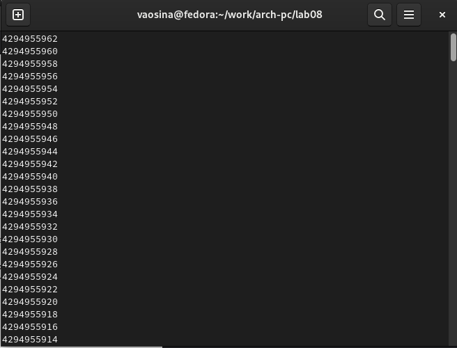

---
## Front matter
title: "Отчёт по лабораторной работе №8"
subtitle: "Дисциплина: Архитектура компьютера"
author: "Осина Виктория Александровна"

## Generic otions
lang: ru-RU
toc-title: "Содержание"

## Bibliography
bibliography: bib/cite.bib
csl: pandoc/csl/gost-r-7-0-5-2008-numeric.csl

## Pdf output format
toc: true # Table of contents
toc-depth: 2
lof: true # List of figures
lot: true # List of tables
fontsize: 12pt
linestretch: 1.5
papersize: a4
documentclass: scrreprt
## I18n polyglossia
polyglossia-lang:
  name: russian
  options:
	- spelling=modern
	- babelshorthands=true
polyglossia-otherlangs:
  name: english
## I18n babel
babel-lang: russian
babel-otherlangs: english
## Fonts
mainfont: PT Serif
romanfont: PT Serif
sansfont: PT Sans
monofont: PT Mono
mainfontoptions: Ligatures=TeX
romanfontoptions: Ligatures=TeX
sansfontoptions: Ligatures=TeX,Scale=MatchLowercase
monofontoptions: Scale=MatchLowercase,Scale=0.9
## Biblatex
biblatex: true
biblio-style: "gost-numeric"
biblatexoptions:
  - parentracker=true
  - backend=biber
  - hyperref=auto
  - language=auto
  - autolang=other*
  - citestyle=gost-numeric
## Pandoc-crossref LaTeX customization
figureTitle: "Рис."
tableTitle: "Таблица"
listingTitle: "Листинг"
lofTitle: "Список иллюстраций"
lotTitle: "Список таблиц"
lolTitle: "Листинги"
## Misc options
indent: true
header-includes:
  - \usepackage{indentfirst}
  - \usepackage{float} # keep figures where there are in the text
  - \floatplacement{figure}{H} # keep figures where there are in the text
---

# Цель работы

Целью данной лабораторной работы ялвяется приобретение навыков написания программ 
с использованием циклов и обработкой аргументов командной строки.

# Задание

1. Реализация циклов в NASM
2. Обработка аргументов командной строки
3. Выполнение задания для самостоятельной работы

# Теоретическое введение

Стек — это структура данных, организованная по принципу LIFO («Last In — First Out»
или «последним пришёл — первым ушёл»). Стек является частью архитектуры процессора и
реализован на аппаратном уровне. Для работы со стеком в процессоре есть специальные
регистры (ss, bp, sp) и команды.

Основной функцией стека является функция сохранения адресов возврата и передачи
аргументов при вызове процедур. Кроме того, в нём выделяется память для локальных
переменных и могут временно храниться значения регистров.
На рис. 8.1 показана схема организации стека в процессоре.

Стек имеет вершину, адрес последнего добавленного элемента, который хранится в ре-
гистре esp (указатель стека). Противоположный конец стека называется дном. Значение,
помещённое в стек последним, извлекается первым. При помещении значения в стек указа-
тель стека уменьшается, а при извлечении — увеличивается.
Для стека существует две основные операции:

* добавление элемента в вершину стека (push);
* извлечение элемента из вершины стека (pop).

Команда push размещает значение в стеке, т.е. помещает значение в ячейку памяти, на
которую указывает регистр esp, после этого значение регистра esp увеличивается на 4.
Данная команда имеет один операнд — значение, которое необходимо поместить в стек.

Существует ещё две команды для добавления значений в стек. Это команда pusha, которая
помещает в стек содержимое всех регистров общего назначения в следующем порядке: ах,
сх, dx, bх, sp, bp, si, di. А также команда pushf, которая служит для перемещения в стек
содержимого регистра флагов. Обе эти команды не имеют операндов.

Команда pop извлекает значение из стека, т.е. извлекает значение из ячейки памяти, на
которую указывает регистр esp, после этого уменьшает значение регистра esp на 4. У этой
команды также один операнд, который может быть регистром или переменной в памяти.
Нужно помнить, что извлечённый из стека элемент не стирается из памяти и остаётся как
“мусор”, который будет перезаписан при записи нового значения в стек.

Аналогично команде записи в стек существует команда popa, которая восстанавливает
из стека все регистры общего назначения, и команда popf для перемещения значений из
вершины стека в регистр флагов.

Для организации циклов существуют специальные инструкции. Для всех инструкций
максимальное количество проходов задаётся в регистре ecx. Наиболее простой является ин-
струкция loop. 

Иструкция loop выполняется в два этапа. Сначала из регистра ecx вычитается единица и
его значение сравнивается с нулём. Если регистр не равен нулю, то выполняется переход к
указанной метке. Иначе переход не выполняется и управление передаётся команде, которая
следует сразу после команды loop.


# Выполнение лабораторной работы
## Реализация циклов в NASM

Создаю каталог lab08 для программ лабораторной работы №8, перехожу в него и 
создаю файл lab8-1.asm, проверяю, что файл создан (рис. @fig:001)

{#fig:001 width=70%}

Перед работой с программами копирую файл in_out.asm в каталог и проверяю, что файл находится в нужном каталоге (рис. @fig:002) (рис. @fig:003)

{#fig:002 width=70%}

{#fig:003 width=70%}

Открываю lab8-1.asm в редакторе и ввожу в него текст программы, которая
выводит значение регистра ecx (рис. @fig:004) и (рис. @fig:005).

{#fig:004 width=70%}

{#fig:005 width=70%}

Создаю исполняемый файл и запускаю его (рис. @fig:006).
В результате выводятся цифры от N до 1.

{#fig:006 width=70%}

Изменяю текст программы добавив значение регистра ecx в цикле (рис. @fig:007)

{#fig:007 width=70%}

Создаю исполняемый файл и запускаю его. (рис. @fig:008).
Теперь программа работает некорректно и цикл не прерывается.
Число проходов цикла не соответствует значению N, введенному с клавиатуры.

{#fig:008 width=70%}

Для использования регистра ecx в цикле и сохранения корректности работы программы
можно использовать стек. Поэтому вношу изменения в текст программы добавив команды push
и pop (добавления в стек и извлечения из стека) для сохранения значения счетчика цикла
loop. (рис. @fig:009).

{#fig:009 width=70%}

Создаю исполняемый файл и запускаю его. (рис. @fig:010)
В результате выводят цифры от N-1 до 0 включительно.
Число проходов цикла соответствует значению N, введенному с клавиатуры.

{#fig:010 width=70%}

## Обработка аргументов командной строки

Создаю файл lab8-2.asm в каталоге ~/work/arch-pc/lab08 и открываю его в редакторе (рис. @fig:011).

{#fig:011 width=70%}

Ввожу в файл текст программы,которая выводит на экран
аргументы командной строки (рис. @fig:012).

{#fig:012 width=70%}

Создаю исполняемый файл и запускаю его.(рис. @fig:013).
Командой было обработано 4 аргумента, так как они разделены пробелом, поэтому, если аргумент содержит пробел, его надо заключать в кавычки

{#fig:013 width=70%}

Создаю файл lab8-3.asm в каталоге ~/work/arch-pc/lab08 и открываю его в редакторе (рис. @fig:014).

{#fig:014 width=70%}

Ввожу в файл текст программы, которая выводит сумму чисел, которые пере-
даются в программу как аргументы. (рис. @fig:015) 

{#fig:015 width=70%}

Создаю исполняемый файл и запускаю его. (рис. @fig:016) и (рис. @fig:017)

Программа работает корректно.

{#fig:016 width=70%}

Изменяю текст программы так, чтобы вместо суммы чисел выводилось произведение аргументов
командной строки

{#fig:017 width=70%}

Создаю исполняемый файл и запускаю его. (рис. @fig:018)

Программа работает корректно.

{#fig:018 width=70%}

## Выполнение задания для самостоятельной работы

Необходимо написать программу, которая находит сумму значений функции f(x) для
x = x1, x2, ..., xn т.е. программа должна выводить значение f(x1) + f(x2) + ... + f(xn).
Значения xi передаются как аргументы.

В соответствии с моим варинтом (вариант7), вид функции 3(х + 2).


Создаю файл var7.asm в каталоге ~/work/arch-pc/lab08 и открываю его в редакторе (рис. @fig:019)

{#fig:019 width=70%}

Ввожу в файл текст программы (рис. @fig:020).

{#fig:020 width=70%}

Создаю исполняемый файл и запускаю его. (рис. @fig:021) и (рис. @fig:022)
Проверяю работу программы на нескольких наборах x = x1, x2, ..., xn.
Программа работает корректно

{#fig:021 width=70%}

{#fig:022 width=70%}

**Проверка** 

```3(x+2), x1 = 1, x2 = 2, x3 = 3

3(1+2) + 3(2+2) + 3(3+2) = 3*3 + 3*4 + 3*5 = 9 + 12 + 15 = 36


3(x+2), x1 = 8, x2 = 3, x3 = 6

3(8+2) + 3(3+2) + 3(6+2) = 3*10 + 3*5 + 3*8 = 30 + 15 + 24 = 69 
```

Текст программы


```%include 'in_out.asm'
SECTION .data
msg db "Результат: ",0
SECTION .text
global _start
_start:

pop ecx 
pop edx
sub ecx,1
mov esi, 0
mov edi, 3

next:

cmp ecx,0h
jz _end
pop eax
call atoi
add eax, 2
mul edi
add esi,eax
loop next

_end:
mov eax, msg
call sprint
mov eax, esi
call iprintLF
call quit

```

# Выводы

При выполнении данной лабораторной работы я приобрела навыкы написания программ с использованием циклов и обработкой
аргументов командной строки.

# Список литературы

1. [Архитектура ЭВМ](https://esystem.rudn.ru/pluginfile.php/2089095/mod_resource/content/0/%D0%9B%D0%B0%D0%B1%D0%BE%D1%80%D0%B0%D1%82%D0%BE%D1%80%D0%BD%D0%B0%D1%8F%20%D1%80%D0%B0%D0%B1%D0%BE%D1%82%D0%B0%20%E2%84%968.%20%D0%9F%D1%80%D0%BE%D0%B3%D1%80%D0%B0%D0%BC%D0%BC%D0%B8%D1%80%D0%BE%D0%B2%D0%B0%D0%BD%D0%B8%D0%B5%20%D1%86%D0%B8%D0%BA%D0%BB%D0%B0.%20%D0%9E%D0%B1%D1%80%D0%B0%D0%B1%D0%BE%D1%82%D0%BA%D0%B0%20%D0%B0%D1%80%D0%B3%D1%83%D0%BC%D0%B5%D0%BD%D1%82%D0%BE%D0%B2%20%D0%BA%D0%BE%D0%BC%D0%B0%D0%BD%D0%B4%D0%BD%D0%BE%D0%B9%20%D1%81%D1%82%D1%80%D0%BE%D0%BA%D0%B8..pdf)


