---
## Front matter
title: "Отчёт по лабораторной работе №8"
subtitle: "Дисциплина: Архитектура компьютера"
author: "Осина Виктория Александровна"

## Generic otions
lang: ru-RU
toc-title: "Содержание"

## Bibliography
bibliography: bib/cite.bib
csl: pandoc/csl/gost-r-7-0-5-2008-numeric.csl

## Pdf output format
toc: true # Table of contents
toc-depth: 2
lof: true # List of figures
lot: true # List of tables
fontsize: 12pt
linestretch: 1.5
papersize: a4
documentclass: scrreprt
## I18n polyglossia
polyglossia-lang:
  name: russian
  options:
	- spelling=modern
	- babelshorthands=true
polyglossia-otherlangs:
  name: english
## I18n babel
babel-lang: russian
babel-otherlangs: english
## Fonts
mainfont: PT Serif
romanfont: PT Serif
sansfont: PT Sans
monofont: PT Mono
mainfontoptions: Ligatures=TeX
romanfontoptions: Ligatures=TeX
sansfontoptions: Ligatures=TeX,Scale=MatchLowercase
monofontoptions: Scale=MatchLowercase,Scale=0.9
## Biblatex
biblatex: true
biblio-style: "gost-numeric"
biblatexoptions:
  - parentracker=true
  - backend=biber
  - hyperref=auto
  - language=auto
  - autolang=other*
  - citestyle=gost-numeric
## Pandoc-crossref LaTeX customization
figureTitle: "Рис."
tableTitle: "Таблица"
listingTitle: "Листинг"
lofTitle: "Список иллюстраций"
lotTitle: "Список таблиц"
lolTitle: "Листинги"
## Misc options
indent: true
header-includes:
  - \usepackage{indentfirst}
  - \usepackage{float} # keep figures where there are in the text
  - \floatplacement{figure}{H} # keep figures where there are in the text
---

# Цель работы

Целью данной лабораторной работы является приобретение навыков написания программ с использованием подпрограмм. Знакомство
с методами отладки при помощи GDB и его основными возможностями.

# Задание

1. Реализация подпрограмм в NASM
2. Отладка программам с помощью GDB
3. Обработка аргументов командной строки в GDB
4. Выполнение задания для самостоятельной работы

# Теоретическое введение


**Понятие об отладке**
 
Отладка — это процесс поиска и исправления ошибок в программе. В общем случае его
можно разделить на четыре этапа:
* обнаружение ошибки;
* поиск её местонахождения;
* определение причины ошибки;
* исправление ошибки.

Можно выделить следующие типы ошибок:
* синтаксические ошибки — обнаруживаются во время трансляции исходного кода и
вызваны нарушением ожидаемой формы или структуры языка;
* семантические ошибки — являются логическими и приводят к тому, что программа
запускается, отрабатывает, но не даёт желаемого результата;
* ошибки в процессе выполнения — не обнаруживаются при трансляции и вызывают пре-
рывание выполнения программы (например, это ошибки, связанные с переполнением
или делением на ноль).

Второй этап — поиск местонахождения ошибки. Некоторые ошибки обнаружить доволь-
но трудно. Лучший способ найти место в программе, где находится ошибка, это разбить
программу на части и произвести их отладку отдельно друг от друга.

Третий этап — выяснение причины ошибки. После определения местонахождения ошибки
обычно проще определить причину неправильной работы программы.

Последний этап — исправление ошибки. После этого при повторном запуске программы,
может обнаружиться следующая ошибка, и процесс отладки начнётся заново.


**Методы отладки**

Наиболее часто применяют следующие методы отладки:
* создание точек контроля значений на входе и выходе участка программы (например,
вывод промежуточных значений на экран — так называемые диагностические сообще-
ния);
* использование специальных программ-отладчиков.
Отладчики позволяют управлять ходом выполнения программы, контролировать и из-
менять данные. Это помогает быстрее найти место ошибки в программе и ускорить её
исправление. Наиболее популярные способы работы с отладчиком — это использование
точек останова и выполнение программы по шагам.

Пошаговое выполнение — это выполнение программы с остановкой после каждой строчки,
чтобы программист мог проверить значения переменных и выполнить другие действия.


Точки останова — это специально отмеченные места в программе, в которых программа-
отладчик приостанавливает выполнение программы и ждёт команд. Наиболее популярные
виды точек останова:
* Breakpoint — точка останова (остановка происходит, когда выполнение доходит до
определённой строки, адреса или процедуры, отмеченной программистом);
* Watchpoint — точка просмотра (выполнение программы приостанавливается, если
программа обратилась к определённой переменной: либо считала её значение, либо
изменила его).

Точки останова устанавливаются в отладчике на время сеанса работы с кодом програм-
мы, т.е. они сохраняются до выхода из программы-отладчика или до смены отлаживаемой
программы.


**Запуск отладчика GDB**

Команда run (сокращённо r) — запускает отлаживаемую программу в оболочке GDB.
Если точки останова не были установлены, то программа выполняется и выводятся сооб-
щения:
```
(gdb) run
Starting program: test
Program exited normally.
(gdb)
```

Для выхода из отладчика используется команда quit (или сокращённо q):
``(gdb) q``


**Дизассемблирование программы**

Посмотреть дизассемблированный код программы можно с помощью команды
disassemble <метка/адрес>:
``(gdb) disassemble _start``


**Точки останова**

Установить точку останова можно командой break (кратко b). Типичный аргумент этой
команды — место установки. Его можно задать как имя метки или как адрес. Чтобы не было
путаницы с номерами, перед адресом ставится «звёздочка»:
```(gdb) break *<адрес>
(gdb) b <метка>
Информацию о всех установленных точках останова можно вывести командой info (крат-
ко i):
(gdb) info breakpoints
(gdb) i b
```

Если же точка останова в дальнейшем больше не нужна, она может быть удалена с помощью
команды delete:
``(gdb) delete breakpoint <номер точки останова>``


**Пошаговая отладка**

Команда stepi (кратко sI) позволяет выполнять программу по шагам, т.е. данная команда
выполняет ровно одну инструкцию
``(gdb) si [аргумент]``

При указании в качестве аргумента целого числа 𝑁 отладчик выполнит команду step 𝑁
раз при условии, что не будет точек останова или выполнение программы не прервётся по
другим причинам.

Команда nexti (или ni) аналогична stepi, но вызов процедуры (функции) трактуется
отладчиком как одна инструкция:
``(gdb) ni [аргумент]``


# Выполнение лабораторной работы
## Реализация подпрограмм в NASM

Создаю каталог lab09 для программ лабораторной работы №9, перехожу в него и 
создаю файл lab9-1.asm, проверяю, что файл создан (рис. @fig:001)

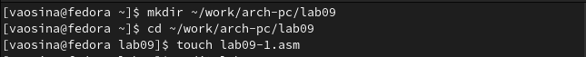{#fig:001 width=70%}

Перед работой с программами копирую файл in_out.asm в каталог и проверяю, что файл находится в нужном каталоге (рис. @fig:002) (рис. @fig:003)

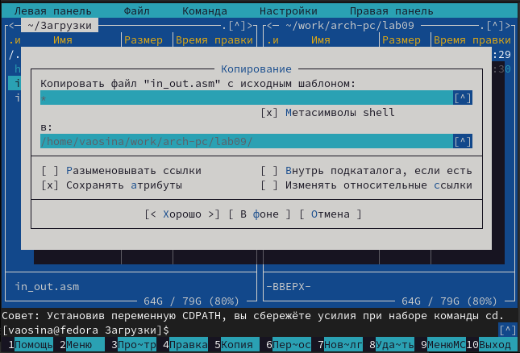{#fig:002 width=70%}

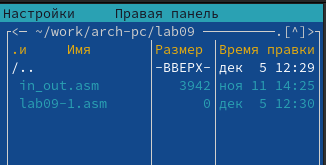{#fig:003 width=70%}

Открываю lab9-1.asm в редакторе и ввожу в него текст программы вычисления арифметического выражения
f(x) = 2x + 7  (рис. @fig:004) и (рис. @fig:005).

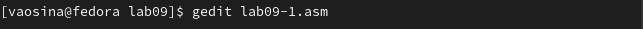{#fig:004 width=70%}

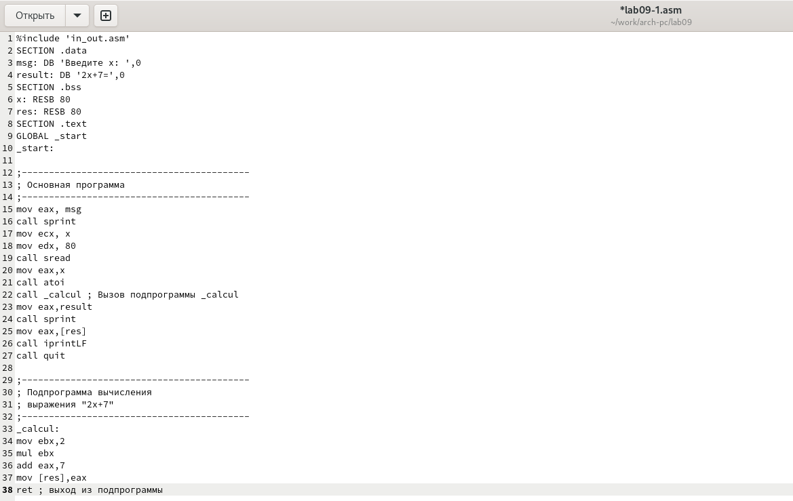{#fig:005 width=70%}

Создаю исполняемый файл и запускаю его (рис. @fig:006).
Программа работает корректно.

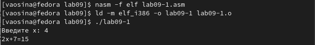{#fig:006 width=70%}

Изменяю текст программы, добавив подпрограмму _subcalcul в подпрограмму _calcul,
для вычисления выражения f(g(x)), где x вводится с клавиатуры, f(x) = 2x + 7, g(x) =
3x − 1. (рис. @fig:007)

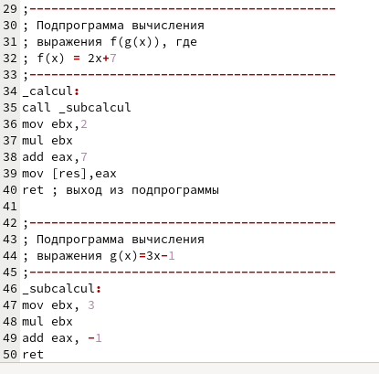{#fig:007 width=70%}

Создаю исполняемый файл и запускаю его. (рис. @fig:008).
Проверяю работу программы на нескольких значениях х.
Программа работает корректно.

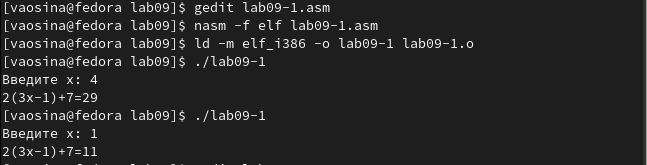{#fig:008 width=70%}


## Отладка программам с помощью GDB

Создаю файл lab9-2.asm в каталоге ~/work/arch-pc/lab09 и открываю его в редакторе (рис. @fig:009).

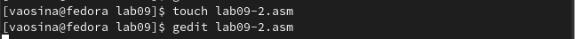{#fig:009 width=70%}

Ввожу в него текст программы печати
сообщения Hello world!. (рис. @fig:010)

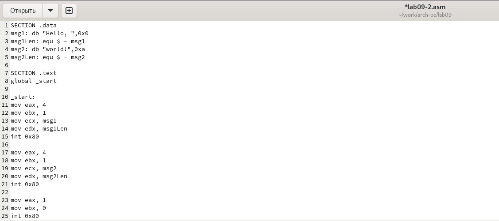{#fig:010 width=70%}

Получаю исполняемый файл с добавлением отладочной информации, 
для этого трансляцию программы провожу с ключом -g. (рис. @fig:011).

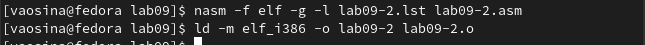{#fig:011 width=70%}

Загружаю исполняемый файл в отладчик gdb. (рис. @fig:012).

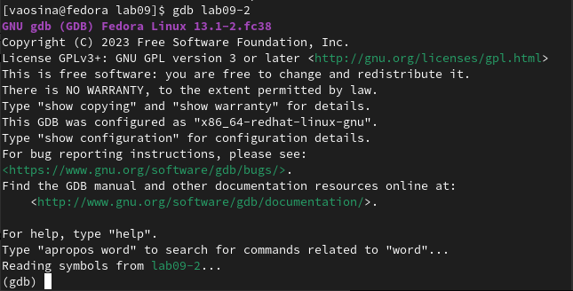{#fig:012 width=70%}

Проверяю работу программы, запустив ее в оболочке GDB с помощью команды run.(рис. @fig:013).

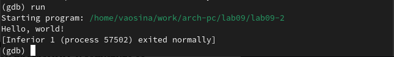{#fig:013 width=70%}

Для более подробного анализа программы устанавливаю брейкпоинт на метку _start и запускаю программу. (рис. @fig:014).

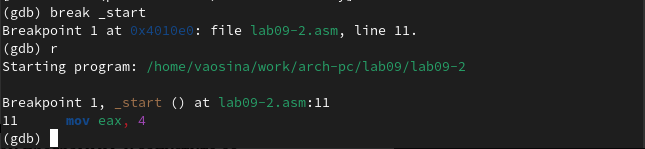{#fig:014 width=70%}

Смотрю дисассимилированный код программы с помощью команды disassemble
начиная с метки _start. (рис. @fig:015) 

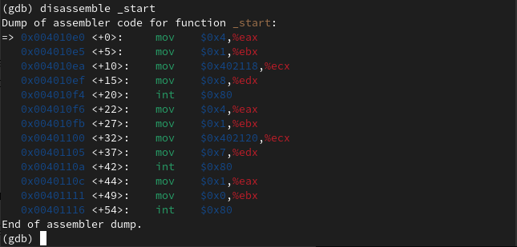{#fig:015 width=70%}

Переключаюсь на отображение команд с Intel’овским синтаксисом, введя команду set
disassembly-flavor intel, и смотрю дисассимилированный код. (рис. @fig:016) и (рис. @fig:017)

Различия отображения синтаксиса машинных команд в режимах ATT и Intel состоят в том,
что в режиме АТТ перед названиями регистров стоит $, а перед операндами %,
а еще после переключения на режим Intel, регистры и операнды поменялись местами.

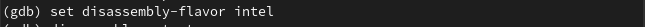{#fig:016 width=70%}

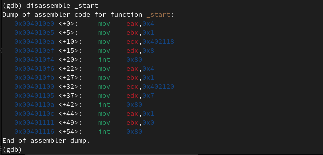{#fig:017 width=70%}

Включаю режим псевдографики для более удобного анализа программы. (рис. @fig:018)

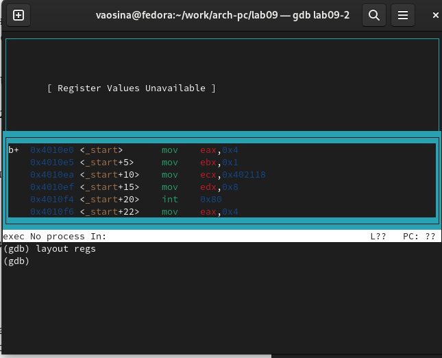{#fig:018 width=70%}

На предыдущих шагах была установлена точка останова по имени метки (_start). 
Проверяю это с помощью команды info breakpoints (кратко i b). (рис. @fig:019)

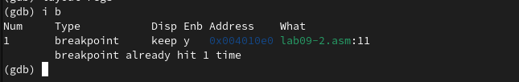{#fig:019 width=70%}

Устанавливаю еще одну точку останова по адресу инструкции mov ebx,0x0 и 
Смотрю информацию о всех установленных точках останова. (рис. @fig:020)

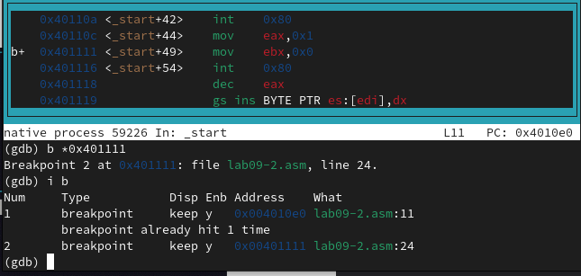{#fig:020 width=70%}

Смотрю содержимое регистров с помощью команды info registers
(или i r). (рис. @fig:021)

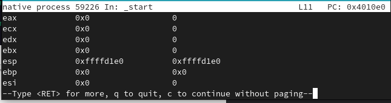{#fig:021 width=70%}

Выполняю 5 инструкций с помощью команды stepi (или si). (рис. @fig:022) и (рис. @fig:023)

Изменились значения регистров eax, ecx, edx, ebx.

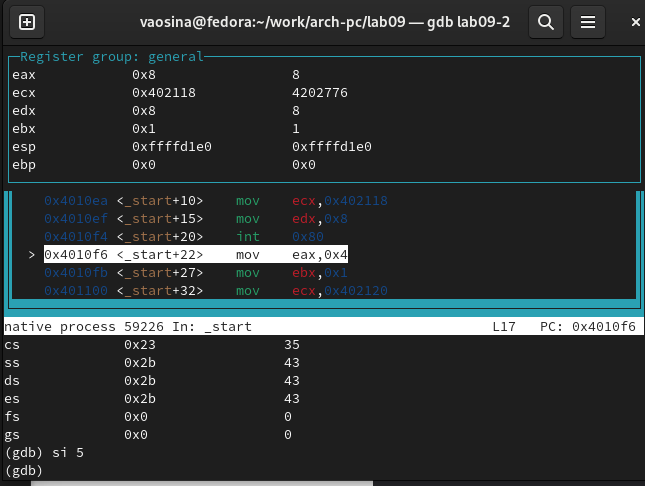{#fig:022 width=70%}

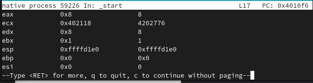{#fig:023 width=70%}

Смотрю значение переменной msg1 по имени. (рис. @fig:024)

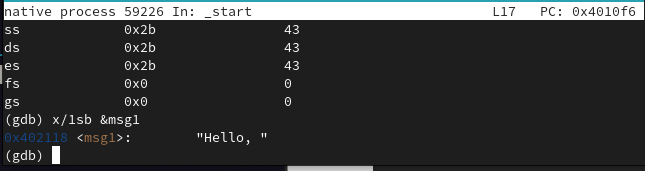{#fig:024 width=70%}

Смотрю значение переменной msg2 по адресу, который определяю
по дизассемблированной инструкции. (на скрине я сначала случайно ввела не тот адрес)(рис. @fig:025)

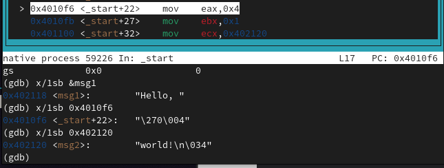{#fig:025 width=70%}

Изменяю первый символ переменной msg1. (рис. @fig:026)

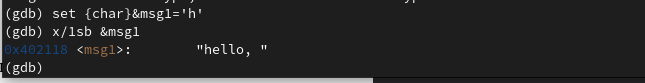{#fig:026 width=70%}

Изменяю символ переменной msg2. (рис. @fig:027)

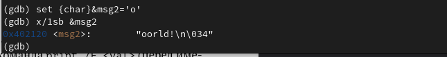{#fig:027 width=70%}

Вывожу в различных форматах (в шестнадцатеричном формате, в двоичном формате и
в символьном виде) значение регистра edx. (рис. @fig:050)

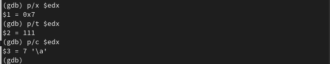{#fig:050 width=70%}

С помощью команды set изменяю значение регистра ebx. (рис. @fig:028)

Разница вывода состоит в том, что в первом случае символ переводится в строковый вид.

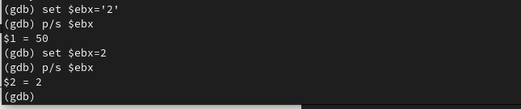{#fig:028 width=70%}

Завершаю выполнение программы с помощью команды continue (сокращенно c) 
и выхожу из GDB с помощью команды quit (сокращенно q). (рис. @fig:029) и (рис. @fig:030)

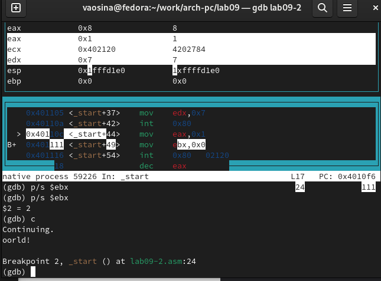{#fig:029 width=70%}

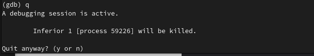{#fig:030 width=70%}


## Обработка аргументов командной строки в GDB

Копирую файл lab8-2.asm, созданный при выполнении лабораторной работы №8,
с программой выводящей на экран аргументы командной строки в файл с
именем lab09-3.asm. (рис. @fig:032)

{#fig:032 width=70%}

Создаю исполняемый файл (рис. @fig:033)

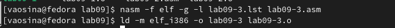{#fig:033 width=70%}

Загружаю исполняемый файл в отладчик, указав аргументы. (рис. @fig:034)

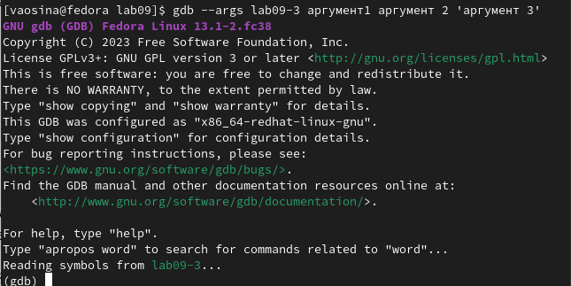{#fig:034 width=70%}

Устанавливаю точку останова перед первой инструкцией в программе и запускаю
ее. (рис. @fig:035)

{#fig:035 width=70%}

Адрес вершины стека храниться в регистре esp и по этому адресу располагается число
равное количеству аргументов командной строки (включая имя программы).(рис. @fig:036)

Как видно, число аргументов равно 5 – это имя программы lab09-3 и непосредственно
аргументы: аргумент1, аргумент, 2 и 'аргумент 3'.

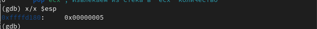{#fig:036 width=70%}

Смотрю остальные позиции стека – по адесу [esp+4] располагается адрес в памяти
где находиться имя программы, по адесу [esp+8] храниться адрес первого аргумента, по
аресу [esp+12] – второго и т.д. (рис. @fig:037)

Шаг изменения адреса равен 4, т.к. 4 - это отводимый размер памяти на ячейку и мы смотрим 
содержимое ячеек.

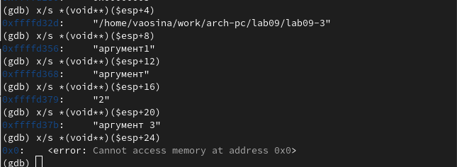{#fig:037 width=70%}


## Выполнение задания для самостоятельной работы

Преобразовываю программу из лабораторной работы №8 (Задание №1 для самостоятельной работы), 
реализовав вычисление значения функции f(x) как подпрограмму. (рис. @fig:038)

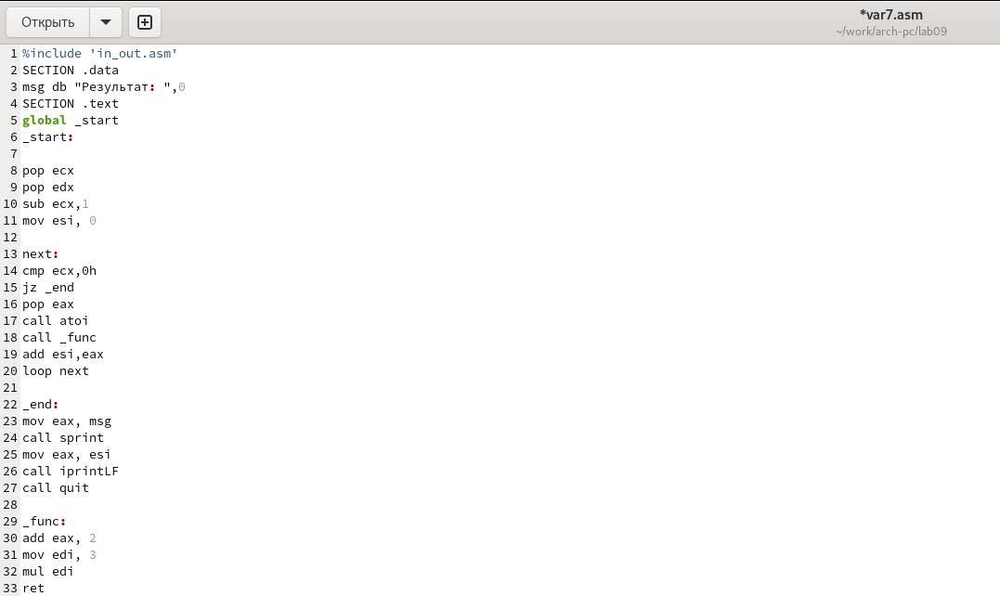{#fig:038 width=70%}

Создаю исполняемый файл и запускаю его. (рис. @fig:039)
Программа работает корректно.

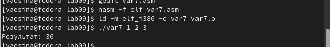{#fig:039 width=70%}

Текст программы:

```
%include 'in_out.asm'
SECTION .data
msg db "Результат: ",0
SECTION .text
global _start
_start:

pop ecx 
pop edx
sub ecx,1
mov esi, 0

next:
cmp ecx,0h
jz _end
pop eax
call atoi
call _func
add esi,eax
loop next

_end:
mov eax, msg
call sprint
mov eax, esi
call iprintLF
call quit

_func:
add eax, 2
mov edi, 3
mul edi
ret

```


Создаю файл var7-2.asm и открываю его в редакторе. (рис. @fig:040)

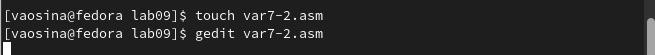{#fig:040 width=70%}

Ввожу текст программы вычисления выражения (3+2)*4+5 из листинга 9.3. (рис. @fig:041)

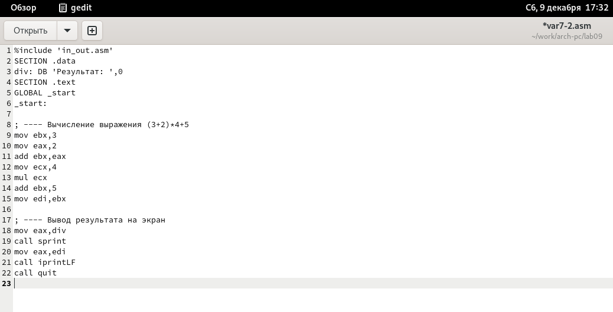{#fig:041 width=70%}

Создаю исполняемый файл и запускаю его. (рис. @fig:042)
Программа действительно работает некорректно.

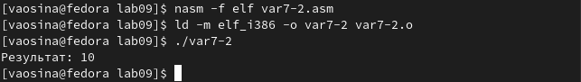{#fig:042 width=70%}

Получаю исполняемый файл с добавлением отладочной информации, 
для этого трансляцию программы провожу с ключом -g и загружаю исполняемый файл в отладчик gdb. (рис. @fig:043)

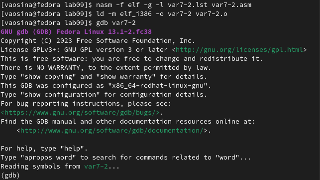{#fig:043 width=70%}

Запускаю программу и устанавливаю точку останова на метке _start, 
чтобы было удобнее анализировать изменения регистров. (рис. @fig:044)

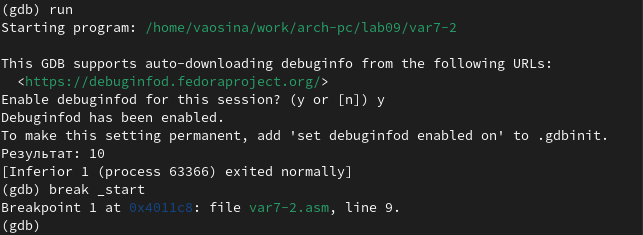{#fig:044 width=70%}

Первую ошибку я замечаю при изменении регистра eax на 8, такого быть не должно.
Мы должны были получить при умножении 20. (рис. @fig:045)

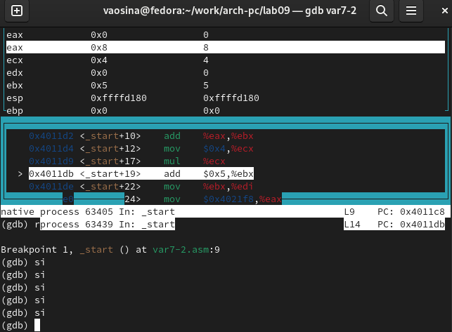{#fig:045 width=70%}

Далее ошибка при последнем действии, т.к. 5 складывается со значением ebx, в котором тоже 5,
в итоге получаем 10, в результате и выводится это значение. (рис. @fig:046)

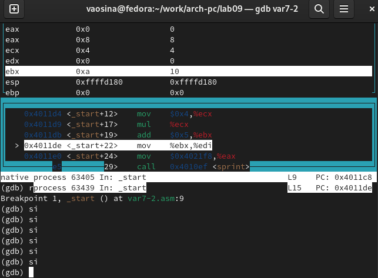{#fig:046 width=70%}

Меняю текст программы таким образом, чтобы она работала корректно. (рис. @fig:047)

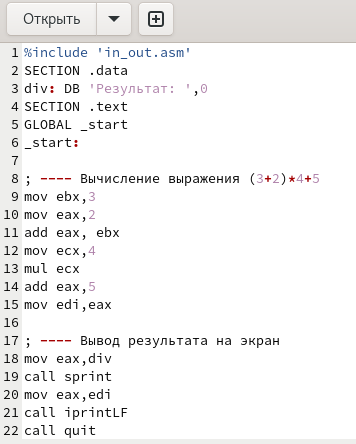{#fig:047 width=70%}

Создаю исполняемый файл и запускаю его. (рис. @fig:048)

Теперь программа работает корректно.

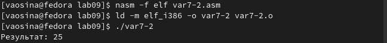{#fig:048 width=70%}

Текст программы:

```
%include 'in_out.asm'
SECTION .data
div: DB 'Результат: ',0
SECTION .text
GLOBAL _start
_start:

; ---- Вычисление выражения (3+2)*4+5
mov ebx,3
mov eax,2
add eax, ebx
mov ecx,4
mul ecx
add eax,5
mov edi,eax

; ---- Вывод результата на экран
mov eax,div
call sprint
mov eax,edi
call iprintLF
call quit
```


# Выводы

При выполнении данной лабораторной работы я приобрела навыки написания программ с использованием подпрограмм и
познакомилась с методами отладки при помощи GDB и его основными возможностями.

# Список литературы

1. [Архитектура ЭВМ](https://esystem.rudn.ru/pluginfile.php/2089096/mod_resource/content/0/%D0%9B%D0%B0%D0%B1%D0%BE%D1%80%D0%B0%D1%82%D0%BE%D1%80%D0%BD%D0%B0%D1%8F%20%D1%80%D0%B0%D0%B1%D0%BE%D1%82%D0%B0%20%E2%84%969.%20%D0%9F%D0%BE%D0%BD%D1%8F%D1%82%D0%B8%D0%B5%20%D0%BF%D0%BE%D0%B4%D0%BF%D1%80%D0%BE%D0%B3%D1%80%D0%B0%D0%BC%D0%BC%D1%8B.%20%D0%9E%D1%82%D0%BB%D0%B0%D0%B4%D1%87%D0%B8%D0%BA%20..pdf)
