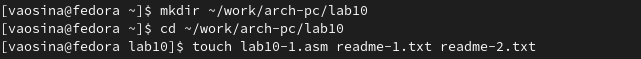
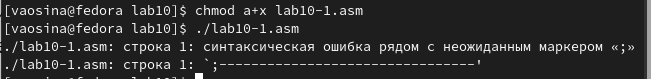

---
## Front matter
title: "Отчёт по лабораторной работе №10"
subtitle: "Дисциплина: Архитектура компьютера"
author: "Осина Виктория Александровна"

## Generic otions
lang: ru-RU
toc-title: "Содержание"

## Bibliography
bibliography: bib/cite.bib
csl: pandoc/csl/gost-r-7-0-5-2008-numeric.csl

## Pdf output format
toc: true # Table of contents
toc-depth: 2
lof: true # List of figures
lot: true # List of tables
fontsize: 12pt
linestretch: 1.5
papersize: a4
documentclass: scrreprt
## I18n polyglossia
polyglossia-lang:
  name: russian
  options:
	- spelling=modern
	- babelshorthands=true
polyglossia-otherlangs:
  name: english
## I18n babel
babel-lang: russian
babel-otherlangs: english
## Fonts
mainfont: PT Serif
romanfont: PT Serif
sansfont: PT Sans
monofont: PT Mono
mainfontoptions: Ligatures=TeX
romanfontoptions: Ligatures=TeX
sansfontoptions: Ligatures=TeX,Scale=MatchLowercase
monofontoptions: Scale=MatchLowercase,Scale=0.9
## Biblatex
biblatex: true
biblio-style: "gost-numeric"
biblatexoptions:
  - parentracker=true
  - backend=biber
  - hyperref=auto
  - language=auto
  - autolang=other*
  - citestyle=gost-numeric
## Pandoc-crossref LaTeX customization
figureTitle: "Рис."
tableTitle: "Таблица"
listingTitle: "Листинг"
lofTitle: "Список иллюстраций"
lotTitle: "Список таблиц"
lolTitle: "Листинги"
## Misc options
indent: true
header-includes:
  - \usepackage{indentfirst}
  - \usepackage{float} # keep figures where there are in the text
  - \floatplacement{figure}{H} # keep figures where there are in the text
---

# Цель работы

Целью данной лабораторной работы является приобретение навыков написания программ для работы с файлами.


# Задание

1. Выполнение лабораторной работы
2. Выполнение задания для самостоятельной работы


# Теоретическое введение

**Права доступа к файлам**
 
Права доступа определяют набор действий (чтение (r), запись (r), выполнение (x)), разрешённых
для выполнения пользователям системы над файлами, дефис (-) - право не дано. Для каждого файла пользователь
может входить в одну из трех групп: владелец (u), член группы владельца (g), все остальные (o). Для
каждой из этих групп может быть установлен свой набор прав доступа.Для предоставления прав доступа 
другому пользователю или другой группе командой

`chown [ключи] <новый_пользователь>[:новая_группа] <файл>`

или

`chgrp [ключи] < новая_группа > <файл>`

Права доступа rw- (чтение и запись, без исполнения) понимаются как
три двоичные цифры 110 или как восьмеричная цифра 6

Полная строка прав доступа в символьном представлении имеет вид:

`<права_владельца> <права_группы> <права_остальных>`

Свойства (атрибуты) файлов и каталогов можно вывести на терминал с помощью команды
ls с ключом -l.

Тип файла определяется первой позицией, это может быть: каталог — d, обычный файл
— дефис (-) или символьная ссылка на другой файл — l.

Для изменения прав доступа служит команда chmod, которая понимает как символьное,
так и числовое указание прав.

Формат символьного режима:

`chmod <категория><действие><набор_прав><файл>`


**Работа с файлами средствами Nasm**

Обработка файлов в операционной системе Linux осуществляется за счет использования
определенных системных вызовов. Для корректной работы и доступа к файлу при его от-
крытии или создании, файлу присваивается уникальный номер (16-битное целое число) –
дескриптор файла.

Общий алгоритм работы с системными вызовами в Nasm можно представить в следующем
виде:

1. Поместить номер системного вызова в регистр EAX;
2. Поместить аргументы системного вызова в регистрах EBX, ECX и EDX;
3. Вызов прерывания (int 80h);
4. Результат обычно возвращается в регистр EAX.


**Открытие и создание файла**

Для создания и открытия файла служит системный вызов sys_creat, который использует
следующие аргументы: права доступа к файлу в регистре ECX, имя файла в EBX и номер
системного вызова sys_creat (8) в EAX.

Для открытия существующего файла служит системный вызов sys_open, который исполь-
зует следующие аргументы: права доступа к файлу в регистре EDX, режим доступа к файлу в
регистр ECX, имя файла в EBX и номер системного вызова sys_open (5) в EAX.
Среди режимов доступа к файлам чаще всего используются:

* (0) – O_RDONLY (открыть файл в режиме только для чтения);
* (1) – O_WRONLY – (открыть файл в режиме только записи);
* (2) – O_RDWR – (открыть файл в режиме чтения и записи).

Системный вызов возвращает файловый дескриптор открытого файла в регистр EAX. В
случае ошибки, код ошибки также будет находиться в регистре EAX.


**Запись в файл**

Для записи в файл служит системный вызов sys_write, который использует следующие
аргументы: количество байтов для записи в регистре EDX, строку содержимого для записи
ECX, файловый дескриптор в EBX и номер системного вызова sys_write (4) в EAX.
Системный вызов возвращает фактическое количество записанных байтов в регистр EAX.
В случае ошибки, код ошибки также будет находиться в регистре EAX.
Прежде чем записывать в файл, его необходимо создать или открыть, что позволит полу-
чить дескриптор файла.


**Чтение файла**

Для чтения данных из файла служит системный вызов sys_read, который использует
следующие аргументы: количество байтов для чтения в регистре EDX, адрес в памяти для
записи прочитанных данных в ECX, файловый дескриптор в EBX и номер системного вызова
sys_read (3) в EAX. Как и для записи, прежде чем читать из файла, его необходимо открыть,
что позволит получить дескриптор файла.


**Закрытие файла**

Для правильного закрытия файла служит системный вызов sys_close, который использует
один аргумент – дескриптор файла в регистре EBX. После вызова ядра происходит удаление
дескриптора файла, а в случае ошибки, системный вызов возвращает код ошибки в регистр
EAX.


**Изменение содержимого файла**

Для изменения содержимого файла служит системный вызов sys_lseek, который исполь-
зует следующие аргументы: исходная позиция для смещения EDX, значение смещения в
байтах в ECX, файловый дескриптор в EBX и номер системного вызова sys_lseek (19) в EAX.

Значение смещения можно задавать в байтах. Значения обозначающие исходную позиции
могут быть следующими:

* (0) – SEEK_SET (начало файла)
* (1) – SEEK_CUR (текущая позиция);
* (2) – SEEK_END (конец файла).

В случае ошибки, системный вызов возвращает код ошибки в регистр EAX.


**Удаление файла**

Удаление файла осуществляется системным вызовом sys_unlink(10), который использует
один аргумент – имя файла в регистре EBX.


# Выполнение лабораторной работы

Создаю каталог lab10 для программ лабораторной работы №10, перехожу в него и 
создаю файл lab10-1.asm, readme-1.txt и readme-2.txt  (рис. @fig:001)

{#fig:001 width=70%}

Перед работой с программами копирую файл in_out.asm в каталог и проверяю, что файл находится
 в нужном каталоге (рис. @fig:002) (рис. @fig:003)

{#fig:002 width=70%}

{#fig:003 width=70%}

Открываю lab10-1.asm в редакторе и ввожу в него текст программы записи в
файл сообщения (рис. @fig:004) и (рис. @fig:005).

{#fig:004 width=70%}

{#fig:005 width=70%}

Создаю исполняемый файл и запускаю его (рис. @fig:006).
Проверяю, записано ли сообщение в нужный файл, и вижу, что сообщение, введённое с клавиатуры,
теперь действительно находится в файле readme-1.txt

{#fig:006 width=70%}

С помощью команды chmod a-x изменяю права доступа к исполняемому файлу lab10-1,
запретив его выполнение. Пытаюсь выполнить файл, после чего выводится надпись "Отказано в доступе".
Так выходит, потому что введённая мной команда, где "а" - "все пользователи", "-" - отмена набора прав,
а "х" - право на исполнение, и подразумевает собой для всех пользователей запрет на исполнение файла,
поэтому я и не могу выполнить файл. (рис. @fig:007)


{#fig:007 width=70%}

С помощью команды chmod a+x изменяю права доступа к файлу lab10-1.asm с исходным
текстом программы, добавив права на исполнение, и пытаюсь исполнить его. В этом случае также выдается ошибка,
т.к. в файле нет команд для терминала. (рис. @fig:008)

{#fig:008 width=70%}

В соответствии со своим вариантом (вариант 7) предоставляю права доступа rw- rwx rw- к файлу readme-1.txt,
представленные в символьном виде. Проверяю правильность выполнения при помощи команды `ls -l`.
Права предоставлены корректно.(рис. @fig:009)

{#fig:009 width=70%}

Для файла readme-2.txt предоставляю права доступа 101 111 111, но т.к. я не разобралась, как их предоставить, используя
двоичное представление, то я использую восьмеричное представление, т.е. 577.
Проверяю правильность выполнения при помощи команды `ls -l`.
Права предоставлены корректно. (рис. @fig:010)

{#fig:010 width=70%}


# Выполнение задания для самостоятельной работы

Создаю файл lab10-2.asm и ввожу в него текст программы (рис. @fig:011), работающей по
следующему алгоритму:

* Вывод приглашения “Как Вас зовут?”
* ввести с клавиатуры свои фамилию и имя
* создать файл с именем name.txt
* записать в файл сообщение “Меня зовут”
* дописать в файл строку введенную с клавиатуры
* закрыть файл 

{#fig:011 width=70%}

Создаю исполняемый файл и запускаю его. Проверяю наличие созданного при исполнении программы файла и вижу,
что он действительно создан и находится в текущем каталоге. После этого проверяю содержимое файла
при помощи команды `cat`. Программа сработала корректно. (рис. @fig:012).

{#fig:012 width=70%}


Текст программы:

```
%include 'in_out.asm'
SECTION .data
filename db 'name.txt', 0h ; Имя файла
msg1 db 'Как Вас зовут? ', 0h ; Сообщение
msg2 db 'Меня зовут ', 0h
SECTION .bss
contents resb 255 ; переменная для вводимой строки
SECTION .text

global _start
_start:

mov eax,msg1
call sprint

mov ecx, contents
mov edx, 255
call sread

mov ecx, 0777o
mov ebx, filename
mov eax, 8
int 80h

mov ecx, 2
mov ebx, filename
mov eax, 5
int 80h

mov esi, eax

mov eax, contents
call slen 

mov eax, msg2 
call slen 

mov edx, eax
mov ecx, msg2
mov ebx, esi
mov eax, 4
int 80h

mov edx, eax
mov ecx, contents
mov ebx, esi
mov eax, 4
int 80h

mov ebx, esi
mov eax, 6
int 80h
call quit
```

# Выводы

При выполнении данной лабораторной работы я приобрела навыки написания программ для работы с файлами.

# Список литературы

1. [Архитектура ЭВМ](https://esystem.rudn.ru/pluginfile.php/2089097/mod_resource/content/0/%D0%9B%D0%B0%D0%B1%D0%BE%D1%80%D0%B0%D1%82%D0%BE%D1%80%D0%BD%D0%B0%D1%8F%20%D1%80%D0%B0%D0%B1%D0%BE%D1%82%D0%B0%20%E2%84%9610.%20%D0%A0%D0%B0%D0%B1%D0%BE%D1%82%D0%B0%20%D1%81%20%D1%84%D0%B0%D0%B9%D0%BB%D0%B0%D0%BC%D0%B8%20%D1%81%D1%80%D0%B5%D0%B4%D1%81%D1%82%D0%B2%D0%B0%D0%BC%D0%B8%20Nasm.pdf)


